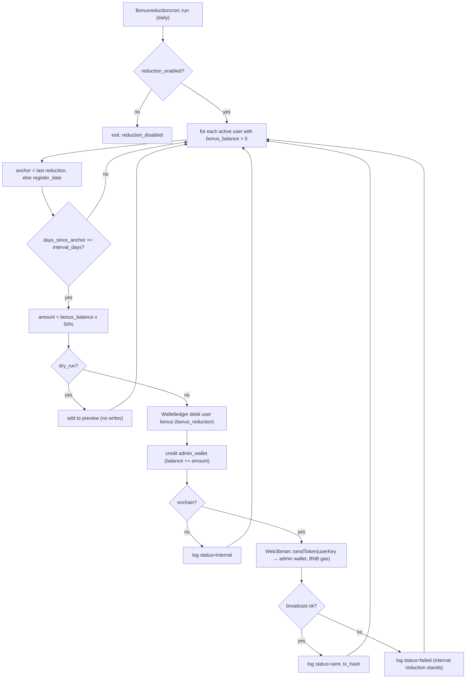

# 11 — Bonus Wallet 60-Day Reduction → Admin Wallet (On-Chain)

Status: 🟢 **Implemented & tested (internal path)** — the on-chain broadcast leg
is wired and ready, pending funded custodial addresses + a set admin bonus
wallet. **Scope is ONLY the Bonus Wallet reduction.** ROI is *not* part of this
(the ROI table/engine is a later phase).

Links: [0_INDEX.md](0_INDEX.md) · [3_CHANGELOG.md](3_CHANGELOG.md) ·
[8_WALLET_DEPOSIT_WITHDRAW.md](8_WALLET_DEPOSIT_WITHDRAW.md) (ledger + Web3bman) ·
[10_BONUS_WALLET_REDUCTION_ADMIN_WALLET.md](10_BONUS_WALLET_REDUCTION_ADMIN_WALLET.md)
(original pre-plan).

---

## 1. The rule

Every **60 days** (configurable — **set to 1 day for testing**), **50%** of a
user's **Bonus Wallet** balance is automatically reduced and given to the
**admin bonus wallet**. The schedule is **per user**, anchored on
`users.register_date`:

> User registers **Jan 1** → after the 60-day cycle completes → the cron reduces
> that user's Bonus balance by 50% and credits the admin. Each user has an
> **independent** schedule based on their own registration date.

On-chain (when enabled): the reclaimed BMAN is sent **from the user's custodial
address to the admin bonus/hot wallet** via `Web3bman::sendToken`, gas paid in
BNB.

**Out of scope:** ROI, maturity, other wallets. ROI is a future table/engine.

---

## 2. Anchor date — `register_date` (not `created_at`)

`users` has **no `created_at`**. It has **`register_date`**
(`e-commerce-mlm-v2_by_asok.sql:2548`), which is the account-creation timestamp.
The per-user cycle anchors on it — computed purely in PHP, no new cycle table.

First reduction fires `interval_days` after `register_date`; each subsequent one
`interval_days` after the previous reduction (rolling).

---

## 3. What was implemented

| File | Purpose |
|---|---|
| `db/bonus_reduction.sql` | Adds `reduction_dry_run` + `reduction_onchain` to `staking_bonus_settings`; ensures `admin_wallet`; creates `bonus_reduction_log` (audit + on-chain tx tracking) |
| `application/models/Bonusreduction_model.php` | **The one place the reduction runs** — shared by the cron and the admin page; plus reads (`adminWallet`, `totals`, `history`) |
| `application/controllers/Bonusreductioncron.php` | Thin scheduled entry point → `Bonusreduction_model::run()` |
| `application/controllers/admin/wallet/Adminwallet.php` + `application/views/admin/wallet/admin_wallet.php` | **Admin ▸ Finance ▸ Admin Bonus Wallet** — the screen: balance cards, settings, reduction history, Preview / Run buttons |
| `application/helpers/site_helper.php` → `user_cycle_info()` | Pure-PHP per-user cycle math from `register_date` |
| `application/config/routes.php` + `admin_sidebar.php` | `bonus-reduction-cron` route, `admin/wallet/admin-wallet` page route, sidebar link |

### Where to see it (admin UI)

**Admin panel → sidebar → Wallet group → "Admin Bonus Wallet"**
(URL `admin/wallet/admin-wallet`). The page shows:
- **Cards:** admin wallet balance (reclaimed pool), lifetime reclaimed, total
  reductions, on-chain sent/failed.
- **Status badges:** enabled, interval (60 / 1-testing), percent, dry-run vs
  execute, on-chain on/off, admin wallet address.
- **History table:** every reduction from `bonus_reduction_log` — user, cycle,
  bonus-before, reduced amount, %, status (INTERNAL/SENT/FAILED), tx-hash link to
  BscScan, timestamp.
- **Preview** (dry-run, lists who is due) and **Run Reduction Now** (super-admin;
  executes per the current on-chain setting).

**Reuses existing infrastructure (nothing rebuilt):**
- `Walletledger_model::debit($uid,'bonus',$amt,'bonus_reduction')` — double-entry,
  row-locked, updates `user_wallets.bonus_balance` + `wallet_ledger`.
- `admin_wallet` (from doc 10) — running reclaimed pool (`balance`,
  `lifetime_bonus_reduction_total`).
- `Web3bman::sendToken()` — offline-signed BEP-20 transfer (BMAN), BNB gas.
- `Custodialwallet_model` / `user_wallet` — per-user address + AES-encrypted key.
- Admin bonus wallet address = `token_settings.bonus_wallet` → fallback
  `treasury_wallet`.

---

## 4. Configuration — `staking_bonus_settings` (single row)

| Column | Meaning | Default | Testing |
|---|---|---|---|
| `reduction_enabled` | master on/off | 1 | 1 |
| `reduction_interval_days` | cycle length | 60 | **1** |
| `reduction_percent` | % reduced each cycle | 50.00 | 50.00 |
| `reduction_dry_run` | 1 = preview only (no writes) | 1 | flip to 0 to execute |
| `reduction_onchain` | 1 = also broadcast on-chain | 0 | 1 when addresses funded |

```sql
-- put the system into testing mode (1-day cycle) and preview:
UPDATE staking_bonus_settings SET reduction_interval_days=1, reduction_dry_run=1 WHERE id=1;
-- actually execute the internal reduction:
UPDATE staking_bonus_settings SET reduction_dry_run=0, reduction_onchain=0 WHERE id=1;
-- also settle on-chain (needs funded user addresses + a set admin wallet):
UPDATE staking_bonus_settings SET reduction_dry_run=0, reduction_onchain=1 WHERE id=1;
```

---

## 5. How it runs

- **CLI:** `php index.php bonusreductioncron run`
- **HTTP:** `/bonus-reduction-cron?token=<cron_token>` (`cron_token` in
  `application/config/config.php`)
- **Schedule:** daily, via the local Windows Task Scheduler setup in
  [scheduler/README.md](../scheduler/README.md) (the cron itself decides which
  users are due that day).

JSON response: `{mode, interval_days, reduction_percent, admin_bonus_wallet,
candidates, processed, skipped_not_due, reduced_total_bman, preview?, ran_at}`.

---

## 6. Flow



---

## 7. Test results (local, DB `e-commerce-mlm-v2`)

Verified end-to-end with user **257** (registered 2026-02-02, bonus 0.25):

| Check | Result |
|---|---|
| Dry-run preview | ✅ candidate 257, would reduce 0.125 (50%) |
| Execute internal | ✅ bonus 0.25 → **0.125**; `admin_wallet.balance` 0 → **0.125** |
| Double-entry ledger | ✅ `wallet_ledger` debit 0.125, `reference_type=bonus_reduction`, `balance_after=0.125` |
| Audit log | ✅ `bonus_reduction_log` row (cycle 1, status `internal`, to = treasury) |
| Idempotent re-run | ✅ same-interval re-run → `skipped_not_due` (no double reduction) |
| 1-day interval, next cycle | ✅ after a day, 2nd reduction 0.125 → **0.0625**, admin → **0.1875** |

Test data was reset afterwards to a clean baseline (257 = 0.25, admin = 0,
logs cleared); handoff config = interval 1, `dry_run=1`.

---

## 8. Enabling the real on-chain transfer

The internal reduction works now. To make the **on-chain** leg move real BMAN:

1. **Set the admin wallet** in Master → Token Settings — `bonus_wallet` (or it
   falls back to `treasury_wallet`, currently `0x3088…d321`).
2. **Fund each user's custodial address** with the BMAN it's sending **and BNB
   for gas** (BEP-20 transfers cost BNB). Without funds the broadcast fails and
   the row is logged `failed` — the internal reduction still applies, and an
   admin can retry the broadcast later.
3. `UPDATE staking_bonus_settings SET reduction_dry_run=0, reduction_onchain=1;`
4. Run the cron — each due user gets a real `sendToken` tx (hash stored on the
   `bonus_reduction_log` row).

> Gas note: on-chain sends need BNB in the sending (user) address. A future
> enhancement can have the `gas_wallet` sponsor BNB to user addresses just before
> the transfer.

---

## 9. Idempotency & safety

- **One reduction per interval per user** — "due" requires
  `days_since_last_reduction ≥ interval_days`; a same-day re-run skips.
- **Dry-run default** — a scheduled run previews rather than silently draining
  balances until an admin sets `reduction_dry_run=0`.
- **Internal-first** — the balance reduction is the source of truth; a failed
  on-chain broadcast never loses it (logged `failed`, retryable).
- **Double-entry** — every reduction is a real `wallet_ledger` row + an
  `admin_wallet` credit.

---

## 10. Later (not now)

- ROI table + engine (separate, future phase — explicitly out of scope here).
- Admin screen for the reclaimed pool + a "retry failed on-chain" button.
- `gas_wallet` auto-sponsoring BNB to user addresses before each transfer.
