# BMAN Staking Platform — Deep Analysis & Virtual Graphs

> **Source of truth:** the BMAN requirements document (18 modules).
> **Implementation base:** the CodeIgniter platform in `admlm/` (controllers, models, and the `e-commerce-mlm-v2_by_asok.sql` schema).
> **Purpose of this file:** explain every module in depth, give worked numeric examples, and draw the system as **virtual graphs** (Mermaid diagrams that render directly in GitHub / VS Code / any Markdown viewer).
>
> Date: 2026-06-30

---

## Table of Contents

1. [What BMAN Is (one paragraph)](#0-what-bman-is)
2. [High-Level System Map](#1-high-level-system-map-virtual-graph)
3. [Module 1 — User Registration & Binary Placement](#2-module-1--user-registration--binary-placement)
4. [Module 2 — KYC Verification](#3-module-2--kyc-verification)
5. [Module 3 — Wallet System](#4-module-3--wallet-system)
6. [Module 3A — Coin Distribution Matrix](#5-module-3a--coin-distribution-matrix)
7. [Module 4–6 — Staking Packages, Plans & ROI](#6-modules-46--staking-packages-plans--roi)
8. [Module 7 — Bonus Coin System](#7-module-7--bonus-coin-system)
9. [Module 8–9 — Binary Tree & Matching Bonus](#8-modules-89--binary-tree--matching-bonus)
10. [Module 10–12 — Rank, Rank Power & Group Ceiling](#9-modules-1012--rank-rank-power--group-ceiling)
11. [Module 13–18 — Reports, Support, Notifications, Security, Admin](#10-modules-1318--reports-support-notifications-security-admin)
12. [End-to-End Money Flow (master virtual graph)](#11-end-to-end-money-flow)
13. [Data Model Map (spec → existing tables)](#12-data-model-map)
14. [Gap Analysis vs. the existing `admlm` code](#13-gap-analysis)

---

## 0. What BMAN Is

**BMAN** is a USDT-based (BEP-20 / Binance Smart Chain) crypto **staking + binary-MLM** platform. A member deposits USDT, the deposit is split across five wallets by a **coin-distribution option**, the member buys a **staking package** under a **plan** (Fixed / Regular / Combo), earns **ROI**, and simultaneously earns **network income** (direct, binary matching, rank rewards, group incentives). Ranks and "rank power" gate how much network income a member can actually withdraw. Everything is wrapped in KYC, OTP/transfer-password security, ticketing, notifications, and an admin dashboard.

The existing `admlm` codebase already implements ~70% of the *mechanics* (binary placement, BV ledger, pair commission, rank config, multi-wallet, KYC, support, reports). BMAN is essentially a **re-skin + rule-tuning** of that engine for a crypto-staking business model — see [§13 Gap Analysis](#13-gap-analysis).

---

## 1. High-Level System Map (virtual graph)

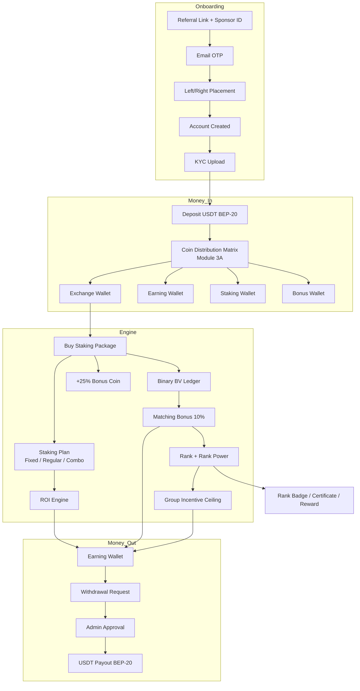

**Reading the graph:** the platform has three pressure zones — **Money In** (deposit → split), the **Engine** (staking + binary that *generates* income), and **Money Out** (withdrawal gated by rank power, ceilings, and admin approval). Every business rule in the spec lives on exactly one of these arrows.

---

## 2. Module 1 — User Registration & Binary Placement

### Rules (from spec)
- Referral link **mandatory**, Sponsor ID **mandatory**.
- Member chooses **Left** or **Right** leg.
- **Email OTP** required before activation.
- Two passwords: **Login password** + **Transfer password** (transfer password protects money movement).

### Registration flow (virtual graph)

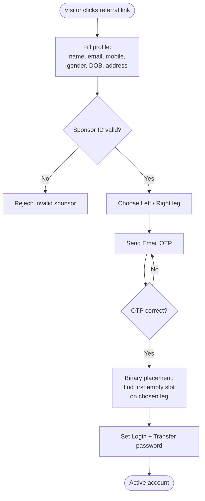

### Binary placement logic — worked example
Sponsor = **U100**, new user **U150** chooses the **Left** leg. Placement walks down the left leg until it finds an open slot (BFS / "spillover"):

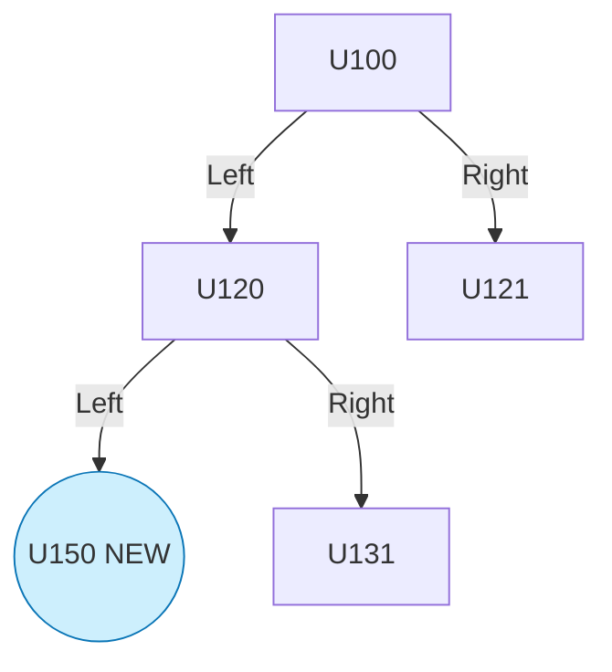

> **Code anchor:** `application/controllers/admin/binary_placement` + table `binary_placement` already model the parent/leg slot structure. Sponsor (referrer) and placement-parent are **two different fields** — sponsor pays *direct* commission, placement-parent feeds *binary BV*.

---

## 3. Module 2 — KYC Verification

| Field | Spec value |
|-------|------------|
| Documents | Aadhaar / Driving License / Passport |
| Uploads | Front, Back, Selfie-with-ID |
| Formats | JPG, PNG, TIFF, GIF |
| Max size | 4 MB per image |

### KYC state machine (virtual graph)

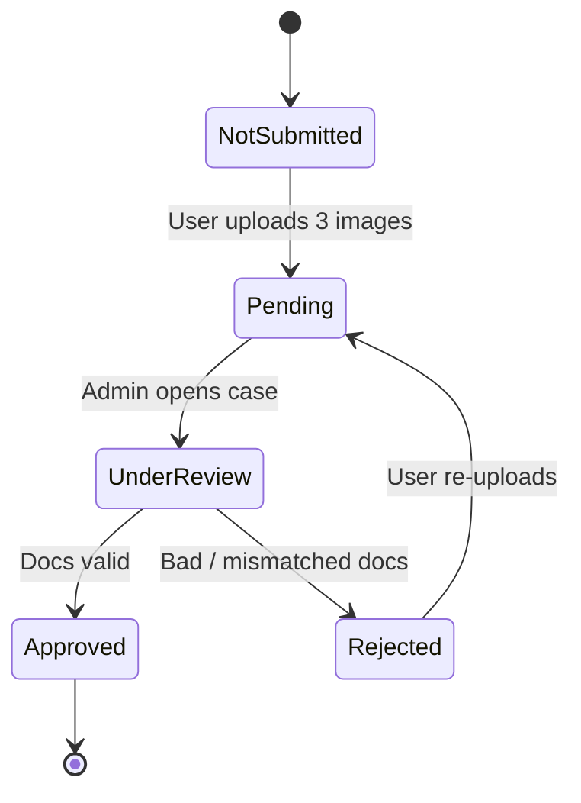

> **Code anchor:** `kyc_applications`, `user_kyc`, `kyc_audit_logs` tables + `AdminKyc.php` / `user/Kyc.php`. The audit-log table already satisfies the spec's "audit logs" requirement. **Gap:** enforce the 4 MB / format whitelist server-side (currently must be verified in `Kyc.php` upload handler).

---

## 4. Module 3 — Wallet System

Five wallet types. Think of them as **buckets with directional rules** — money can flow *into* some only from specific sources, and *out* only to specific destinations.

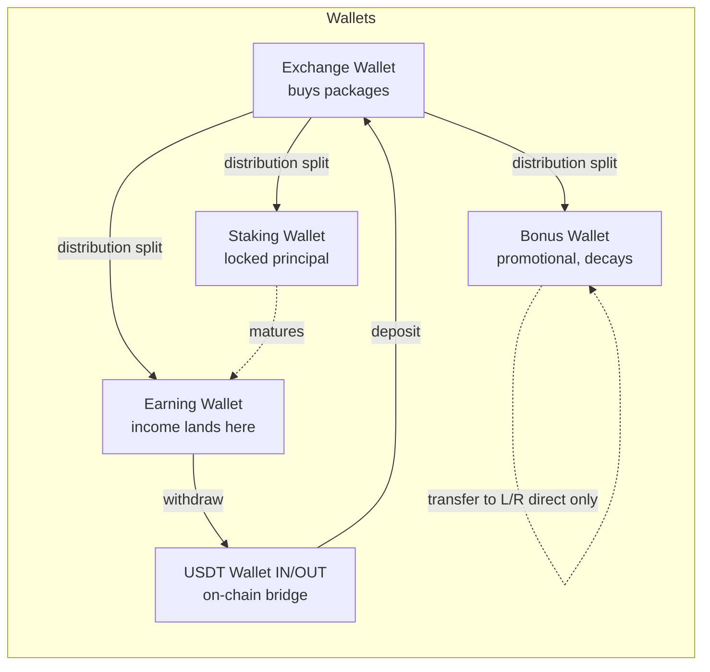

**Features required:** deposit / withdrawal / transfer history, wallet statement, PDF + Excel export.

> **Code anchor:** `user_wallets` (+ legacy `user_wallet`), `wallet_transactions`, `deposits`. Controllers in `application/controllers/admin/wallet` and `Wallet_model.php`. Statement export already exists via the reports layer (`Reports_model.php`, `BusinessReport.php`).

---

## 5. Module 3A — Coin Distribution Matrix

This is the heart of "where does my deposited USDT go?" A deposit is **split across 4 coin balances**; total must always = **100%**.

### The matrix (from spec)

| Option | Exchange | Earning | Staking | Bonus |
|:------:|:--------:|:-------:|:-------:|:-----:|
| 1 | 100% | 0% | 0% | 0% |
| 2 | 90% | 0% | 0% | 10% |
| 3 | 80% | 10% | 0% | 10% |
| 4 | 80% | 10% | 10% | 0% |
| 5 | 90% | 10% | 0% | 0% |
| 6 | 90% | 0% | 10% | 0% |
| 7 | 70% | 10% | 10% | 10% |

### Distribution decision (virtual graph)

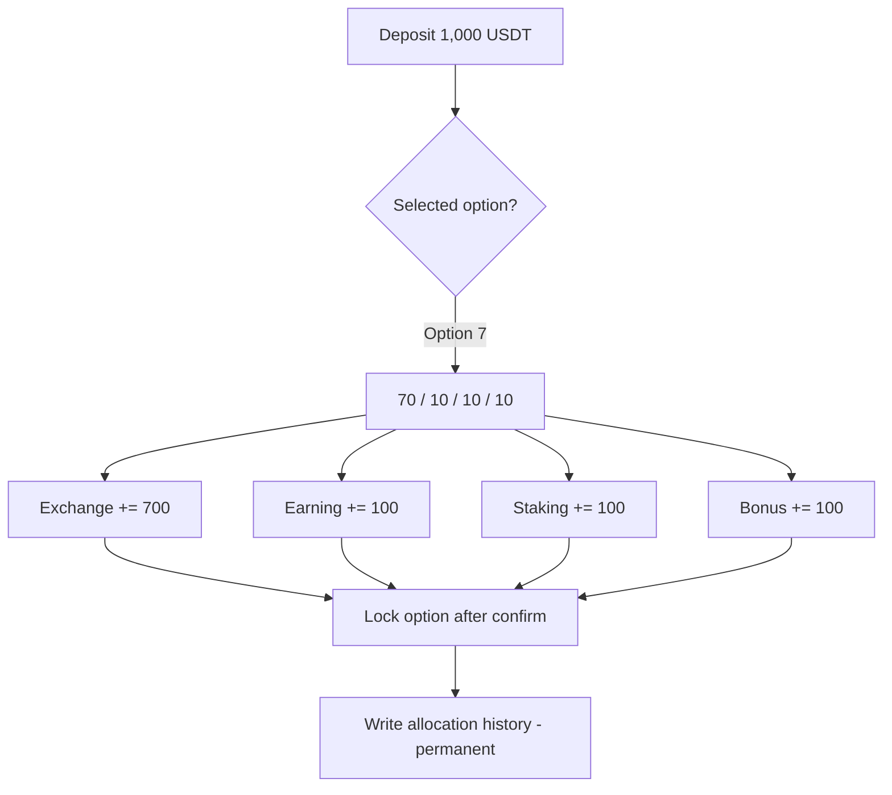

### Worked example — Option 7 on a 1,000 USDT deposit
```
Exchange  = 1000 × 70% = 700 USDT  → available to buy packages
Earning   = 1000 × 10% = 100 USDT  → withdrawable income bucket
Staking   = 1000 × 10% = 100 USDT  → locked staking principal
Bonus     = 1000 × 10% = 100 USDT  → promo, decays 50% / 60 days
                         ----------
Total                  = 1000 USDT  ✅ (== 100%, business rule satisfied)
```

**Business rules to enforce in code:**
1. `sum(percentages) == 100` (reject otherwise).
2. Option **locks** after transaction confirmation.
3. Allocation history is **permanent** (insert-only table).
4. Only **Super Admin** may edit the percentage matrix → write to audit log.

> **Implementation note:** The existing `package_config` already proves the platform stores JSON config arrays (`matching_bonus_json`, `level_pv_json`, `product_level_comm_json`). The distribution matrix is best stored the same way — a `distribution_config` table with a `splits_json` column like `{"exchange":70,"earning":10,"staking":10,"bonus":10}`, validated to sum to 100.

---

## 6. Modules 4–6 — Staking Packages, Plans & ROI

### Packages
`5,000 / 10,000 / 20,000 / 25,000 / 50,000 / 100,000 / 200,000 / 300,000 / 500,000` BMAN.

### Plans
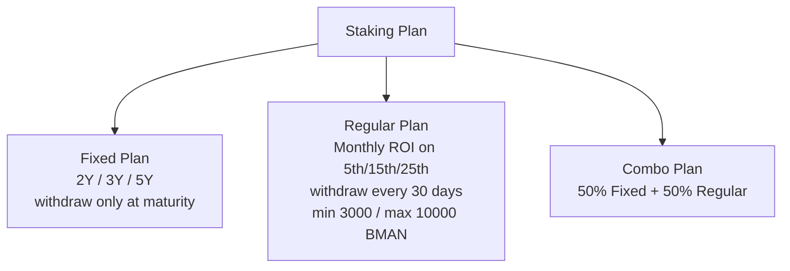

### ROI structure (from spec)

| Stake | Fixed 2Y | Fixed 3Y | Fixed 5Y | Regular 2Y | Regular 3Y | Regular 5Y |
|------:|:--------:|:--------:|:--------:|:----------:|:----------:|:----------:|
| 5,000 – 100,000 | 150% | 200% | 400% | 2.3% | 2.5% | 3.0% |
| 200,000 | 160% | 210% | 410% | 2.5% | 3.2% | 3.2% |
| 300,000 | 180% | 230% | 430% | 2.8% | 3.3% | 3.3% |
| 500,000 | 200% | 250% | 450% | 3.0% | 3.5% | 3.5% |

> **Important interpretation:** Fixed % = **total return over the whole term**; Regular % = **monthly ROI rate**.

### Worked examples

**A) Fixed 5Y, 100,000 BMAN @ 400% total**
```
Total payout at maturity = 100,000 × 400% = 400,000 BMAN
Withdrawal: only after 5-year maturity (principal optionally returned per package flag).
```

**B) Regular 3Y, 50,000 BMAN @ 2.5% monthly**
```
Monthly ROI = 50,000 × 2.5% = 1,250 BMAN
Credited on the 5th, 15th, 25th  → split 3 times/month (≈416.67 each) OR
                                    one 1,250 credit/month depending on config.
36 months × 1,250 = 45,000 BMAN over the term (before any compounding).
Withdraw window: every 30 days, min 3,000 / max 10,000 BMAN per withdrawal.
```

**C) Combo, 20,000 BMAN (3Y)**
```
Fixed half  = 10,000 @ 200% (3Y) = 20,000 at maturity
Regular half= 10,000 @ 2.5%/mo    = 250 BMAN/month
Member gets monthly cashflow AND a maturity lump sum.
```

### ROI engine timeline (virtual graph)

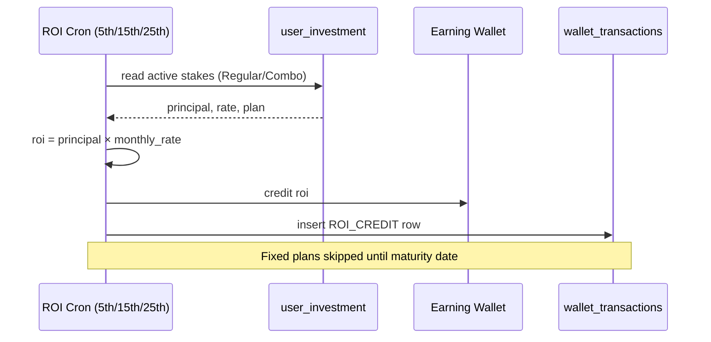

> **Code anchor:** `package_config` (period, roi, duration, days_duration, retrun_principle), `user_investment`, and the cron files `earn-cron-made`, `binary-cron-made`, `rank-cron-made` at repo root. The platform **already runs ROI/earn/rank crons** — BMAN re-uses them with the BMAN rate table.

---

## 7. Module 7 — Bonus Coin System

Three rules:
1. **+25% bonus coin** on every stake purchase.
2. **−50% of bonus wallet every 60 days** (decay).
3. **Transfer** allowed **only to direct Left or direct Right** sponsored member (OTP + transfer password).

### Bonus lifecycle (virtual graph)

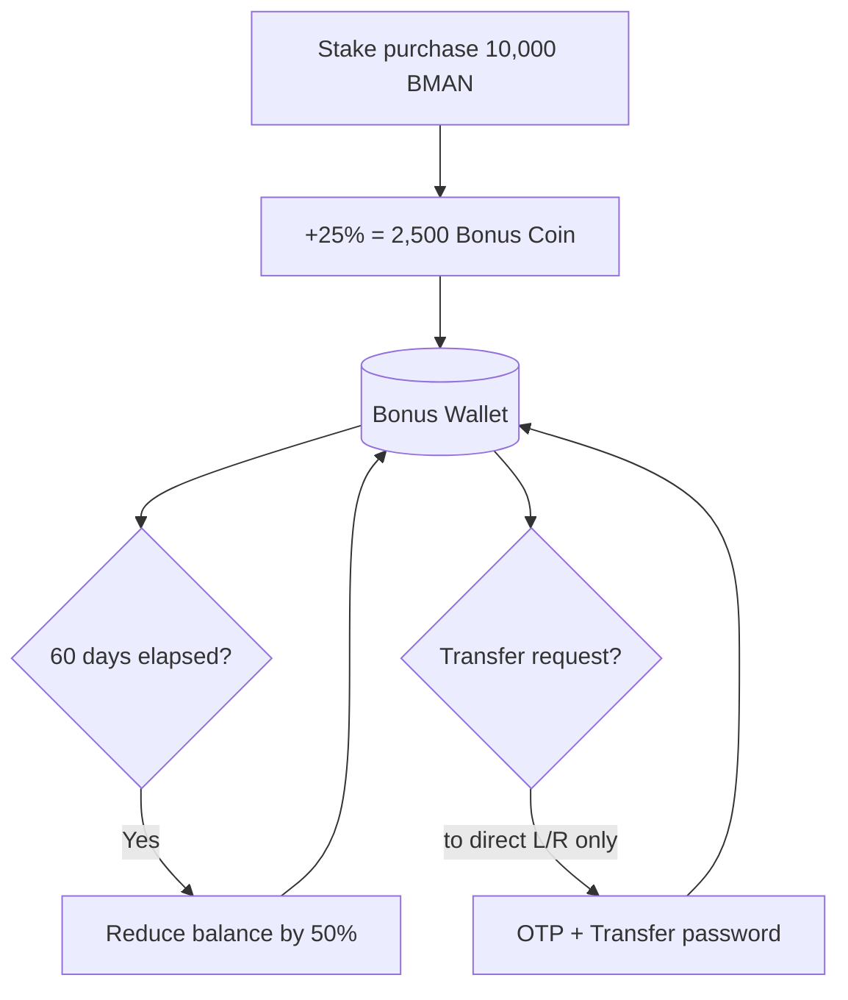

### Worked example — decay
```
Day 0  : buy 10,000 stake → +2,500 bonus  (balance 2,500)
Day 60 : decay 50%        → balance 1,250
Day 120: decay 50%        → balance   625
```
> The decay is **aggressive by design** — it pushes members to *use or transfer* bonus coin quickly rather than hoard it.

---

## 8. Modules 8–9 — Binary Tree & Matching Bonus

### Binary structure & views
Left leg / Right leg, plus Binary tree, Genealogy tree, Generation tree, Level-wise team, Direct team, **Carry-forward volume**.

### Matching bonus = **10%**, split:
- **8% → Earning Coin**
- **2% → Staking Coin**

### Binary matching engine (virtual graph)

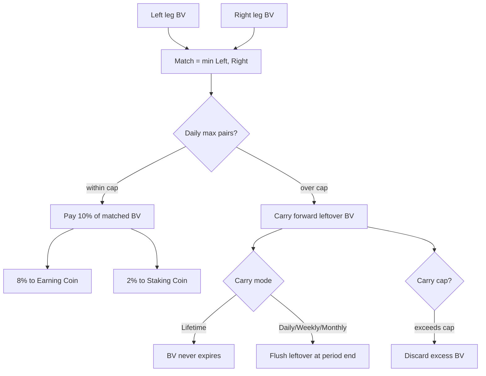

### Worked example — matching + carry forward
```
Left BV  = 90,000      Right BV = 50,000
Matched  = min(90k,50k) = 50,000 BV
Payout   = 50,000 × 10% = 5,000
           → 4,000 to Earning Coin (8%)
           → 1,000 to Staking Coin (2%)

Leftover Left BV = 90,000 − 50,000 = 40,000
Carry mode = LIFETIME → 40,000 stays for tomorrow.
Carry cap  = 50,000   → 40,000 < cap, fully kept.
```

> **Code anchor — this is already built.** Tables `binary_volume_ledger`, `binary_carry`, `commission_config` (with `carry_forward_status`, `carry_forward_mode`, `carry_forward_cap`, `binary_pair_ratio`, `daily_max_pairs`). The settings HTML and the `package_config` row in `docs/temp/analysis.txt` show `daily_max_pairs`, `matching_bonus_json [10,7,5,2]`, and carry-forward fields are live. BMAN sets matching to the 8/2 split via `binary_pair_type` + a 2-way credit. The spec's note *"I need above feature on `_settle_pairs_for_ancestors`"* is the exact function that walks ancestors and settles pairs.

---

## 9. Modules 10–12 — Rank, Rank Power & Group Ceiling

### Three independent rank concepts (don't confuse them)

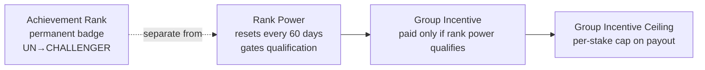

### Rank ladder (virtual graph)

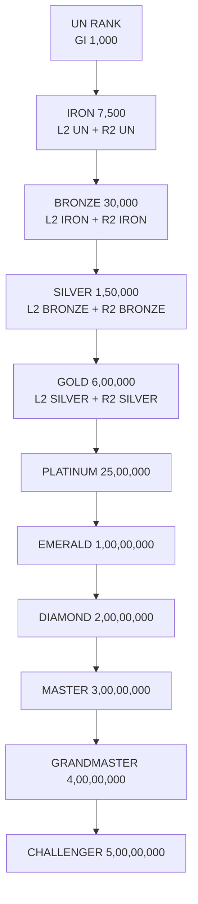

Each rank has **3 qualification plans** (Plan-1 = balanced legs, Plan-2/3 = lop-sided "deep leg" alternatives). Example for **BRONZE**:
- **Plan-1:** Left 2 IRON **and** Right 2 IRON
- **Plan-2:** Left 2 IRON **and** Right 12 UN RANK
- **Plan-3:** Left 12 UN RANK **and** Right 2 IRON

> Logic: a member qualifies for a rank if **any one** of the three plans is satisfied. This rewards both *balanced* builders and *one-strong-leg* builders.

### Group Incentive Ceiling (Module 12) — worked example
The ceiling caps how much group incentive a stake can earn:

| Stake | Ceiling |
|------:|--------:|
| 5,000 | 5,000 |
| 50,000 | 30,000 |
| 100,000 | 30,000 |
| 200,000 | 50,000 |
| 500,000 | 100,000 |

```
Member staked 100,000 → group-incentive ceiling = 30,000.
Even if downline performance "earns" 45,000 in group incentive,
the member receives only 30,000. Excess 15,000 is forfeited (or
requires re-stake to raise the ceiling).
```

### Rank Power reset (virtual graph)

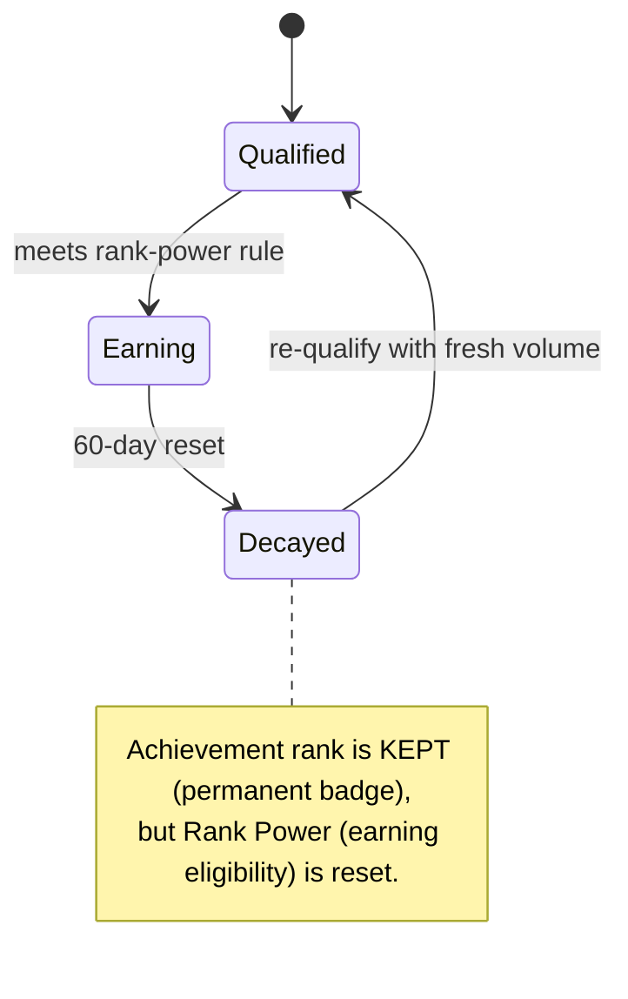

> **Code anchor:** `rank_config` table + `application/controllers/admin/rank`, `Rank_model.php`, `Myrank.php`, root cron `rank-cron-made` and `run_monthly_rank_commission` / `update_all_users_rank`. The "resets every 60 days" is a scheduled job toggling a `rank_power` field separate from the permanent `rank` field.

---

## 10. Modules 13–18 — Reports, Support, Notifications, Security, Admin

### Module 13 — Team Reports
Binary / Generation / Level-wise / Direct / Rank / Active-Inactive. → `Reports_model.php`, `BusinessReport.php`.

### Module 14 — Support Ticket (virtual graph)

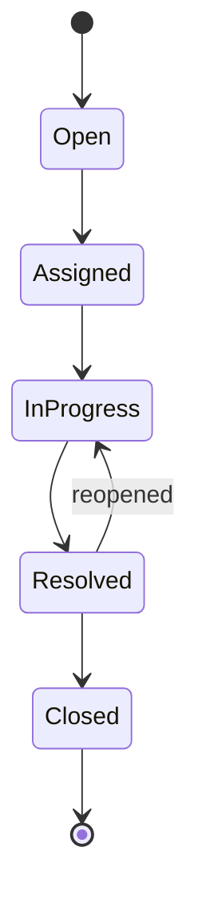
Categories: KYC, Deposit, Withdrawal, Staking, Binary Bonus, Technical. → `support`, `support_message` tables, `application/controllers/admin/support`.

### Module 15 — Notifications
Email (registration, KYC approval, ROI credit, rank achievement, withdrawal status, ticket updates) + Push (security & achievement alerts). → `email_config`, `email_template`, `email_log`, `notification` tables.

### Module 16 — Security
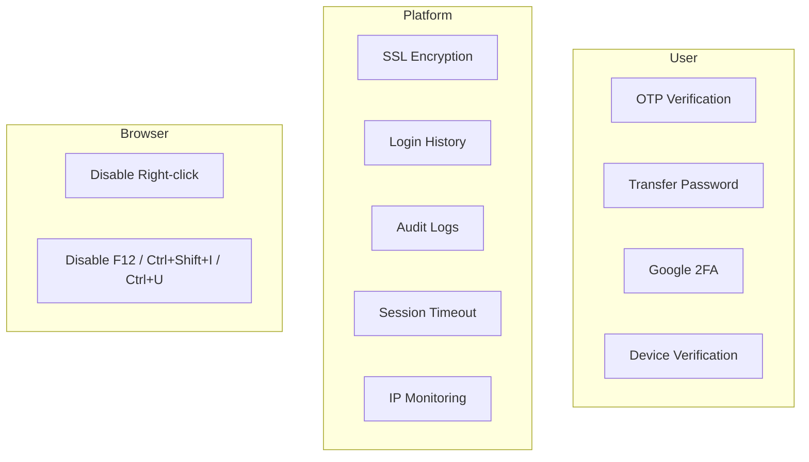
→ `blocked_ips`, `user_activity_logs`, `user_email_otp`, `GlobalVerify.php`. **Gap:** Google 2FA + device verification need adding; browser controls are front-end JS.

### Module 17 — Admin Dashboard
KPI cards (total users, active users, total staking, ROI paid, withdrawals, bonus coin) + state-wise charts + India/World map analytics. → `Administrator.php`, `BusinessReport.php`, `Reports_model.php`.

### Module 18 — Reports & MIS
All reports exportable to **PDF / Excel / CSV**. Blockchain: **BEP-20 (Binance Smart Chain)**.

---

## 11. End-to-End Money Flow

The single most important diagram — how 1 USDT travels from deposit to payout:

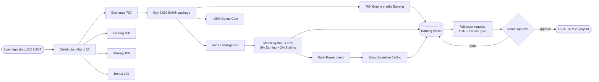

---

## 12. Data Model Map

How BMAN spec concepts map onto **existing** `admlm` tables (from `e-commerce-mlm-v2_by_asok.sql`):

| BMAN concept | Existing table(s) | Status |
|--------------|-------------------|:------:|
| Member / profile / passwords | `users`, `user_addresses` | ✅ exists |
| Sponsor + binary slot | `binary_placement` | ✅ exists |
| Binary BV + carry | `binary_volume_ledger`, `binary_carry` | ✅ exists |
| 5 wallets | `user_wallets`, `wallet_transactions` | ✅ exists (needs 5 wallet *types*) |
| Deposits (USDT in) | `deposits`, `payment_settings`, `payment_controls` | ✅ exists |
| Staking package | `package_config` | ✅ exists (re-tune to BMAN packages) |
| Active stake | `user_investment` | ✅ exists |
| Commission rules | `commission_config` | ✅ exists |
| Ranks | `rank_config` | ✅ exists |
| KYC | `kyc_applications`, `user_kyc`, `kyc_audit_logs` | ✅ exists |
| Support | `support`, `support_message` | ✅ exists |
| Notifications | `email_config/template/log`, `notification` | ✅ exists |
| Security / IP | `blocked_ips`, `user_activity_logs`, `user_email_otp` | ✅ exists |
| **Coin distribution matrix (3A)** | *(none)* | ❌ **add** `distribution_config` + `allocation_history` |
| **Bonus coin decay (Mod 7)** | *(none explicit)* | ❌ **add** decay cron + bonus ledger |
| **Rank Power 60-day reset (Mod 11)** | `rank_config` (partial) | ⚠️ **add** `rank_power` field + reset cron |
| **Group incentive ceiling (Mod 12)** | *(none)* | ❌ **add** ceiling table keyed by package |

---

## 13. Gap Analysis

What the `admlm` engine **already gives BMAN for free** vs. what must be **built/tuned**:

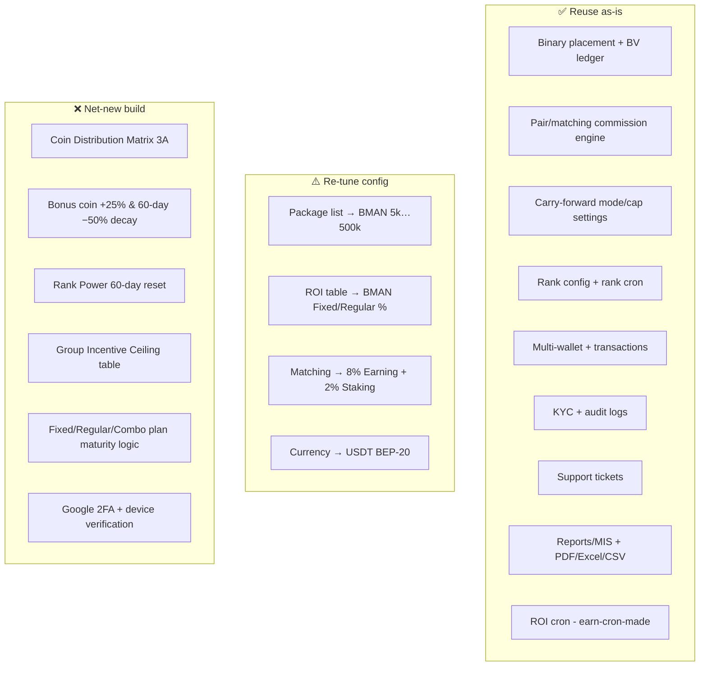

### Priority recommendation
1. **Distribution Matrix (3A)** — blocks every deposit; build first.
2. **Plan maturity logic** (Fixed lock vs Regular 30-day window) — core staking promise.
3. **Bonus decay + Rank Power reset crons** — reuse the existing cron pattern (`rank-cron-made`, `earn-cron-made`).
4. **Group incentive ceiling** — a lookup table + a cap check at payout time.

---

### Appendix — Where to look in the code

| Area | Path |
|------|------|
| Binary settlement | `application/.../_settle_pairs_for_ancestors` (per spec note) |
| Package config UI | form in `docs/temp/analysis.txt` → `POST /package-update` |
| Commission config UI | form in `docs/temp/analysis.txt` → `POST /update-commission-settings` |
| Crons | `binary-cron-made`, `earn-cron-made`, `rank-cron-made`, `run_monthly_rank_commission`, `update_all_users_rank` (repo root) |
| Schema | `db/e-commerce-mlm-v2_by_asok.sql` |
| Models | `application/models/*` (`Rank_model`, `Wallet_model`, `Profit_model`, `Order_model`, `Kyc_model`, `Reports_model`) |

*All diagrams above are Mermaid "virtual graphs" — they render automatically in GitHub, GitLab, VS Code (with Mermaid preview), and Obsidian.*
