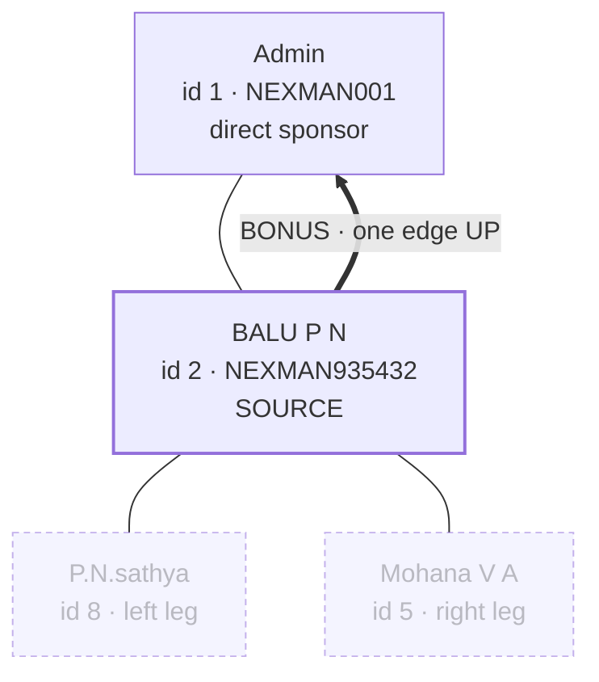
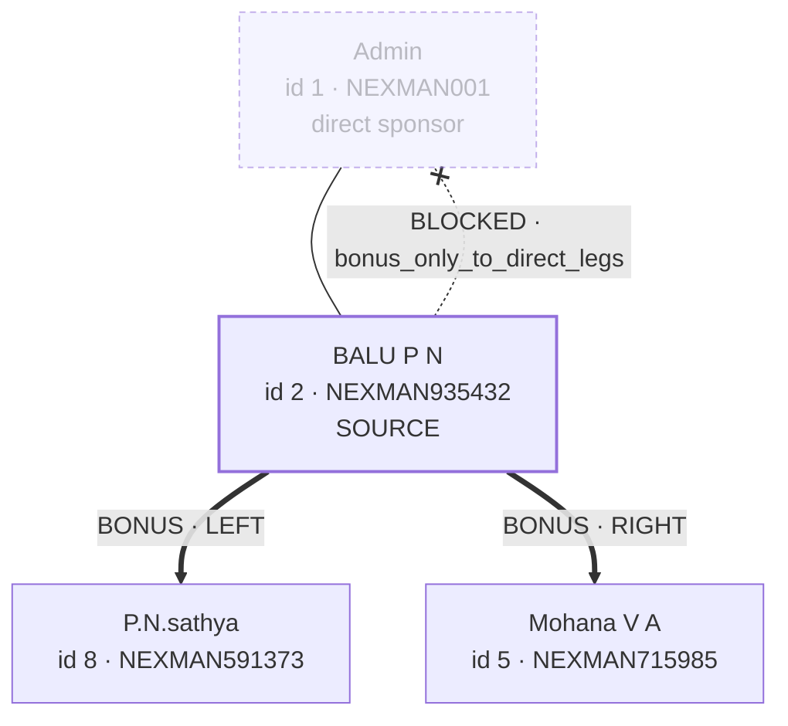
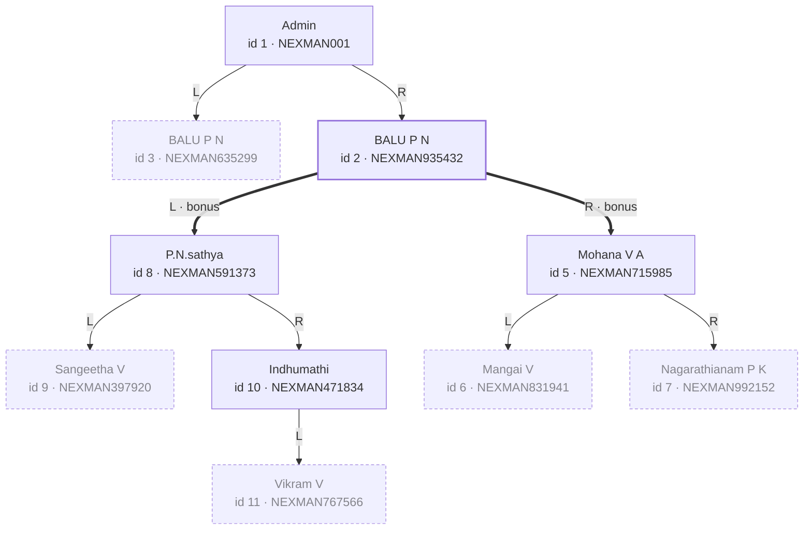
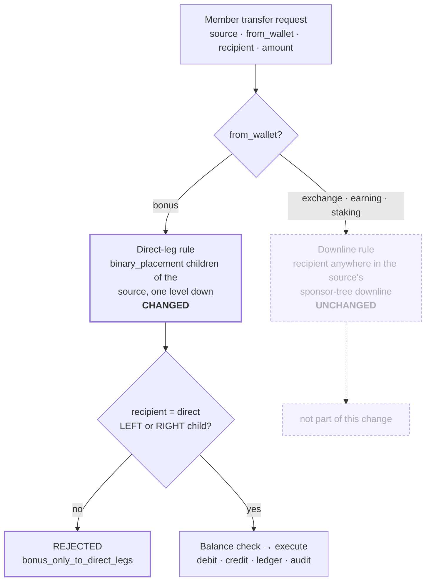

# 2026-08-27 — Wallet Transfer Engine · Rule change: bonus travels one edge down the binary tree

The **bonus** wallet used to move **up** the sponsor chain — a member could only
send bonus to their direct sponsor. It now moves **down the binary tree**, to the
direct **left** or direct **right** leg member and nobody else.

Engine doc: [16_WALLET_TRANSFER_ENGINE.md](16_WALLET_TRANSFER_ENGINE.md) ·
Module doc: [9_INTERNAL_WALLET_TRANSFER.md](9_INTERNAL_WALLET_TRANSFER.md) ·
Changelog: [3_CHANGELOG.md](3_CHANGELOG.md).

> **Superseded the same day.** The "one edge, direct leg only" depth below was
> widened to **2 levels** a few hours later — see the 2026-08-27 changelog
> entry titled "Bonus Coin Transfer: widen direct leg (1 level) → binary leg
> downline (2 levels)" and [16_WALLET_TRANSFER_ENGINE.md](16_WALLET_TRANSFER_ENGINE.md)
> for the current rule. Kept below as the historical record of what shipped
> first; the mermaid diagrams and the "1 recipient" eligibility counts in §7
> now describe the *original* depth-1 rule, not the current one.

---

## 1. The rule

| | Was | Now |
|---|---|---|
| **Direction** | one edge **up** | one edge **down** |
| **Tree read** | `users.sponser` (sponsor chain) | `binary_placement.parent_id` + `position` (binary tree) |
| **Eligible recipients** | the direct sponsor | the direct **left** and direct **right** leg member |
| **Count** | exactly 1 | 0, 1 or 2 — however many legs are filled |
| **Reject code** | `bonus_only_to_sponsor` | `bonus_only_to_direct_legs` |

Bonus is now **exactly one binary edge, downward**. The direct sponsor, deeper
downline, siblings and unrelated members are all rejected.

### Before



The two leg members below could not receive bonus at all.

### After



---

## 2. Scope — what did NOT change

**Bonus only.** Everything else in the engine is untouched:

- `exchange` / `earning` / `staking` member transfers keep the **downline** rule
  (recipient anywhere in the source's sponsor-tree downline).
- Internal own-wallet transfers keep **Exchange-source-only**
  (`exchange → bonus · earning · staking`, no reverse, no other pairs).
- Balance, KYC, transfer-password, idempotency, ledger, settlement and audit
  behaviour are all unchanged.
- Existing bonus transfers already written under the old rule are **not**
  rewritten or re-judged. Only new requests are evaluated by the new rule.

---

## 3. Which tree — the part that will bite later

This app has **two different trees**, and "direct left / right user" was
ambiguous between them:

| Table | Column | Meaning |
|---|---|---|
| `users` | `sponser` | sponsor chain. **May hold an id OR a referral_id** — that is why `downlineIds()` matches on both at every level. |
| `binary_placement` | `parent_id` + `position` (`left`/`right`) | the binary tree the Binary Tree page draws. Has its own `sponsor_id` column and a `placement_type` enum (`direct`/`auto`). |

Bonus deliberately follows **`binary_placement.parent_id`** — the relationship
drawn on the Binary Tree page — **not** the sponsor chain.

> **Today this choice is invisible.** All 9 `binary_placement` rows currently have
> `parent_id == sponsor_id` and `placement_type = 'direct'`, so both readings
> return the same answer. The moment a spillover / `auto` placement exists they
> diverge. If someone later reports "bonus went to the wrong person", check
> whether that recipient's `parent_id` and `sponsor_id` differ **before**
> assuming a bug.

---

## 4. Tree map — every legal bonus route in the live tree

The rule is universal, so it reads straight off the tree: **every** parent-to-child
edge is a legal bonus hop, and nothing else is.



Every arrow above is a legal single-hop bonus route. The emphasised pair is the
worked example: source **id 2 BALU P N** may send bonus to **id 8 P.N.sathya**
(left) and **id 5 Mohana V A** (right).

Note what the picture rules out: **no arrow ever points up**, and **no arrow ever
skips a level** — so id 2 cannot reach id 1 above, nor id 9 two levels below.
Dashed nodes are leaves (no leg children) — see §7.

---

## 5. Decision flow

Both panels call the one engine, so this is the only place the rule lives. The
dropdown scoping is convenience; **this** is the gate.



Because the rule sits in the engine rather than in the dropdown, a hand-crafted
request that skips the picker is rejected the same way — confirmed in §8.

---

## 6. Implementation

All of it lives in the single shared engine
`application/models/wallet/Wallettransferservice_model.php`, which both the User
Panel and the Admin Panel already called — so both changed together.

**Rule dispatch**

```php
public function memberRule($wallet)
{
    if (in_array($wallet, ['exchange','earning','staking'], true)) return 'downline';
    if ($wallet === 'bonus') return 'direct_legs';   // was 'direct_sponsor'
    return null;
}
```

**New helpers** (binary tree, not sponsor chain)

- `directLegChildren($userId)` → `['left' => int|0, 'right' => int|0]`, read from
  `binary_placement` on `parent_id` + `position`.
- `directLegChildIds($userId)` → plain id list, **left leg first**, empty legs
  dropped.

**Enforcement** in `validate()`:

```php
if ($rule === 'direct_legs') {
    if (!in_array($recipientId, $this->directLegChildIds($src), true))
        return $this->_no('bonus_only_to_direct_legs',
            'Bonus wallet can only be transferred to your direct left or direct right leg member.');
}
```

**Recipient scoping** in `recipientOptions()` returns at most the two leg
children (active only), ordered left leg first, honouring the search box — so
neither panel's picker can offer an invalid recipient.

**Detail modal**: the `direct_sponsor` validation check became `direct_legs`
("Direct leg validation") and names the actual side, left or right. Rows written
before this rule existed can name a recipient that is not a leg child; those
report the rule generically rather than claiming a leg that isn't there.

---

## 7. Consequence — half the members can no longer send bonus

This is a real behaviour change rather than a bug, and it is the one thing worth
deciding on deliberately. Eligibility now depends on having **children**, not on
having a sponsor — and a leaf node has none.

| | Sponsor rule (was) | Direct-leg rule (now) |
|---|---|---|
| Members who can send bonus | **9** of 10 (everyone except Admin) | **5** of 10 |
| Max recipients per member | 1 | 2 |

Per member, from live data:

| Member | Left child | Right child | Bonus recipients now |
|---|---|---|---|
| id 1 Admin | id 3 | id 2 | 2 |
| id 2 BALU P N | id 8 | id 5 | 2 |
| id 5 Mohana V A | id 6 | id 7 | 2 |
| id 8 P.N.sathya | id 9 | id 10 | 2 |
| id 10 Indhumathi | id 11 | — | **1** |
| id 3 BALU P N | — | — | **0** |
| id 6 Mangai V | — | — | **0** |
| id 7 Nagarathianam P K | — | — | **0** |
| id 9 Sangeetha V | — | — | **0** |
| id 11 Vikram V | — | — | **0** |

- **A leaf member's bonus picker is legitimately empty.** That is the rule
  working as specified, not a failure — but it will generate support questions if
  nobody is expecting it.
- **A half-filled leg gives exactly one recipient** (id 10 Indhumathi).
- **Eligibility grows with the tree.** A leaf becomes able to send bonus the
  moment someone is placed beneath them. No migration or backfill is involved.

---

## 8. Verified

Every row below was run against the live local database
(`e-commerce-mlm-v2`) through the **real HTTP endpoint**, source user
`id 2 BALU P N`.

| From wallet | Recipient | Relationship to id 2 | Result | Code |
|---|---|---|---|---|
| `bonus` | id 8 P.N.sathya | direct **left** leg | ALLOWED | `ok` |
| `bonus` | id 5 Mohana V A | direct **right** leg | ALLOWED | `ok` |
| `bonus` | id 1 Admin | direct sponsor *(was the only option)* | BLOCKED | `bonus_only_to_direct_legs` |
| `bonus` | id 6 Mangai V | two levels down | BLOCKED | `bonus_only_to_direct_legs` |
| `bonus` | id 9 Sangeetha V | two levels down | BLOCKED | `bonus_only_to_direct_legs` |
| `bonus` | id 3 BALU P N | other branch of the tree | BLOCKED | `bonus_only_to_direct_legs` |
| `earning` | id 11 Vikram V | deep downline | ALLOWED | `ok` · unchanged |
| `exchange` | id 1 Admin | upline, not downline | BLOCKED | `recipient_not_in_downline` · unchanged |
| `exchange` | id 6 Mangai V | deep downline | rule passes | `insufficient_balance` · unchanged |

**Recipient pickers.** For source `id 2` with `from_wallet=bonus`:

- `POST user/transfer_wallet/search_recipients` — previously returned a single
  row (`id 1 Admin`), now returns exactly two, left leg first:
  `id 8 P.N.sathya` then `id 5 Mohana V A`.
- `GET admin/finance/internal-transfers/recipients?sender_id=2&from_wallet=bonus`
  — same two members, same order.
- The other three wallets still return the full seven-member downline.

**Test suites**

```bash
php index.php wallettransfertest run
```

- **19/19** rule tests (3 new: bonus→sponsor, bonus→deeper downline,
  bonus→unrelated are all rejected).
- **6/6** UI-support tests (`… ui`), including
  `recipientOptions(bonus)` = at most the two leg children, never the sponsor.
- **3/3** execution + idempotency tests (`… exec`) unaffected.

A new CLI helper prints the exact JSON **both** recipient endpoints return, per
wallet — far faster than driving the UI when checking a rule change:

```bash
php index.php wallettransfertest pickers 2
```

---

## 9. Files changed

| File | What |
|---|---|
| `application/models/wallet/Wallettransferservice_model.php` | **the rule**, recipient scoping, two new binary-tree helpers, detail-modal check |
| `assets/js/wallet_transfer_ui.js` | shared front-end rule key + hint text for both panels |
| `application/controllers/Wallettransfertest.php` | new rejection cases + `pickers` dump |
| `application/controllers/user/Transfer_wallet.php` | comment only |
| `application/controllers/admin/wallet/Internaltransfers.php` | comment only |
| `application/views/admin/wallet/internal_transfers.php` | comment only |
| `docs/16_WALLET_TRANSFER_ENGINE.md` | rule table, validation summary, picker scoping, test counts |
| `docs/3_CHANGELOG.md` | changelog entry |

**Apply:** no SQL, no route changes. The only deploy step is a hard refresh so
the updated `assets/js/wallet_transfer_ui.js` is picked up.
