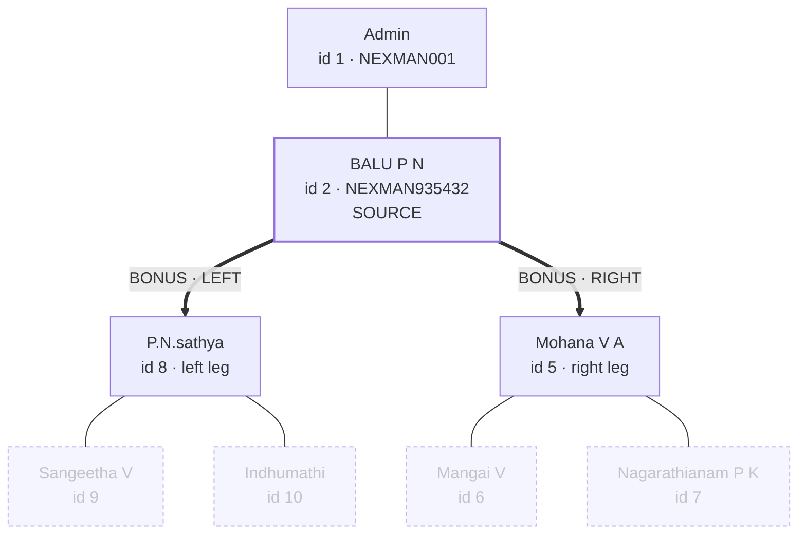
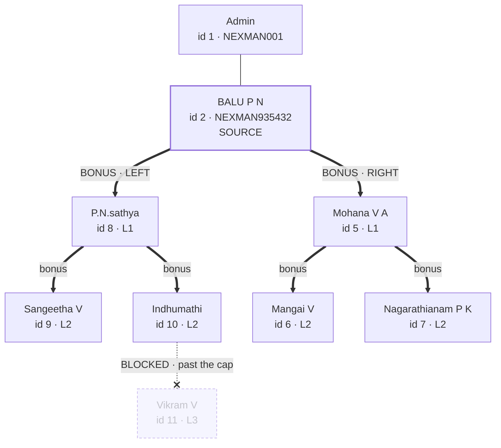
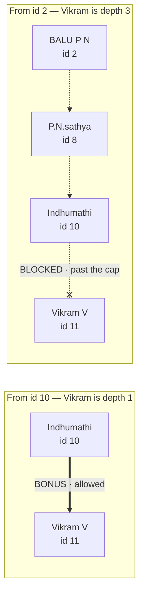
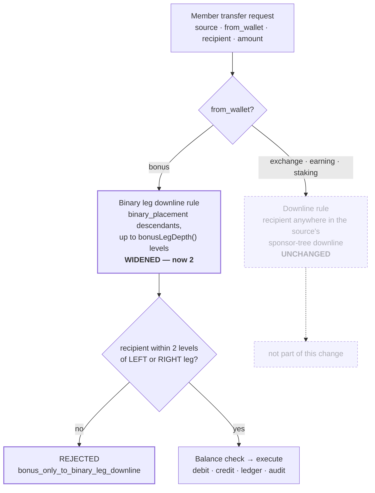

# 2026-08-27 — Wallet Transfer Engine · Rule change: bonus reaches two levels down each binary leg

Same-day follow-up to
[27_08_26_bonus_transfer_rule_1.md](27_08_26_bonus_transfer_rule_1.md), per
explicit instruction against the published tree diagram: bonus's reach grows
from **one edge down** each binary leg to **two levels down** each leg.

Engine doc: [16_WALLET_TRANSFER_ENGINE.md](16_WALLET_TRANSFER_ENGINE.md) ·
Changelog: [3_CHANGELOG.md](3_CHANGELOG.md).

---

## 1. The rule

| | Was (this morning) | Now |
|---|---|---|
| **Reach** | one edge down each leg | up to **2 levels** down each leg |
| **Eligible recipients** | the direct left and direct right leg member | everyone within 2 levels down either leg |
| **Count** | 0, 1 or 2 | 0 to 6 — however many of the four depth-2 slots are filled |
| **Reject code** | `bonus_only_to_direct_legs` | `bonus_only_to_binary_leg_downline` |

Still exactly the two legs, never the sponsor, never the other branch. What
changed is how far down each leg counts.

### Before (depth 1)



### After (depth 2)



The two grandchildren under each leg (`L2`) are newly eligible today. One real
node in this tree sits exactly one hop past the new boundary: **id 11 Vikram
V**, three hops from source id 2 — the dashed blocked edge above.

---

## 2. Scope — what did NOT change

**Bonus only**, same as this morning:

- `exchange` / `earning` / `staking` keep the unchanged downline rule.
- Internal own-wallet transfers keep Exchange-source-only.
- Balance, KYC, transfer-password, idempotency, ledger, settlement and audit
  behaviour are all unchanged.
- Existing bonus transfers already written under either older rule are **not**
  rewritten or re-judged.
- **Who can send anything didn't change.** The same 5 of 10 seed members
  (`#1, #2, #5, #8, #10`) had a non-empty leg under the 1-level rule too —
  see §5. Today's change grows how many recipients each of them sees, not
  who's eligible to send something.

---

## 3. Reach depends on where the source stands

The sharpest way to see what a depth cap actually means: the **same member**
can be in range for one source and out of range for another.

**id 11 Vikram V** is **id 10 Indhumathi**'s own direct (depth-1) leg child —
if she were the source, he'd clearly qualify. From **id 2**, three hops up the
chain, he's one hop past the cap. Nothing about Vikram changed; only who's
asking.



---

## 4. Every member's own zone

Each member's eligible set is centered on themselves, not on some fixed global
list. Real counts from the live tree:

| Member | Left leg | Right leg | Bonus recipients |
|---|---|---|---|
| id 1 Admin | id 3 (leaf) | id 2 → id 8, id 5 | **4** |
| id 2 BALU P N | id 8 → id 9, id 10 | id 5 → id 6, id 7 | **6** — full depth-2 zone |
| id 8 P.N.sathya | id 9 (leaf) | id 10 → id 11 | **3** |
| id 5 Mohana V A | id 6 (leaf) | id 7 (leaf) | **2** |
| id 10 Indhumathi | id 11 (leaf) | — empty | **1** |
| id 3, id 6, id 7, id 9, id 11 | both legs empty | | **0** each |

A leaf still has zero either way — that was never about the depth cap, it's
about having no children to send to.

---

## 5. Decision flow

Only the bonus branch moved; the rest of the engine is unchanged from
[27_08_26_bonus_transfer_rule_1.md](27_08_26_bonus_transfer_rule_1.md).



---

## 6. Implementation

Same single shared engine,
`application/models/wallet/Wallettransferservice_model.php` — widening the
depth changed the same method again.

**Depth is one property**

```php
private $bonusLegDepth = 2;   // was implicitly 1 (a single directLegChildren() hop)
```

**New helpers** (replace the 1-hop-only helpers in the bonus path; the
originals stay, correctly named, as building blocks / test helpers)

- `binaryLegDownline($userId, $maxLevel = null)` → `['left' => [...], 'right' => [...]]`,
  one recursive `WITH RECURSIVE … WHERE depth < ?` query, same pattern as
  `BinaryModel`'s existing subtree queries — tags each descendant with which
  top-level leg it fell under, so "left"/"right" survives past depth 1.
- `binaryLegDownlineIds($userId, $maxLevel = null)` → flat id list, ordered
  shallowest-first (level 1 left/right, then level 2 left/right — not "all of
  the left leg, then all of the right leg").
- `binaryLegSide($sourceId, $recipientId, $maxLevel = null)` → `'left'` /
  `'right'` / `''`, for the detail-modal validation check.

**Enforcement** in `validate()`:

```php
if ($rule === 'binary_leg_downline') {
    if (!in_array($recipientId, $this->binaryLegDownlineIds($src), true))
        return $this->_no('bonus_only_to_binary_leg_downline',
            'Bonus wallet can only be transferred to a member within ' . $this->bonusLegDepth .
            ' level(s) down your left or right binary leg.');
}
```

**Recipient scoping** in `recipientOptions()` returns up to `2·(2^depth − 1)`
members (6, at depth 2) — never truncated below that just because a caller
passed a small `$limit`.

---

## 7. Verified

Every row below was run against the live local database through the real HTTP
endpoint, source user `id 2 BALU P N`.

| From wallet | Recipient | Relationship to id 2 | Result | Code |
|---|---|---|---|---|
| `bonus` | id 8 P.N.sathya | left leg, depth 1 | ALLOWED | `ok` |
| `bonus` | id 5 Mohana V A | right leg, depth 1 | ALLOWED | `ok` |
| `bonus` | id 10 Indhumathi | left leg, depth 2 — *newly allowed* | ALLOWED | `ok` |
| `bonus` | id 6 Mangai V | right leg, depth 2 — *newly allowed* | ALLOWED | `ok` |
| `bonus` | id 11 Vikram V | depth 3 — **past the cap** | BLOCKED | `bonus_only_to_binary_leg_downline` |
| `bonus` | id 1 Admin | direct sponsor | BLOCKED | `bonus_only_to_binary_leg_downline` |
| `bonus` | id 3 BALU P N | other branch of the tree | BLOCKED | `bonus_only_to_binary_leg_downline` |
| `exchange` | id 1 Admin | upline, not downline | BLOCKED | `recipient_not_in_downline` · unchanged |
| `exchange` | id 6 Mangai V | deep downline | rule passes | `insufficient_balance` · unchanged |

**Recipient pickers**, confirmed by actually opening the picker in a live
browser (real select2 dropdown, not just curl). For source `id 2` with
`from_wallet=bonus`: both panels now render exactly **6** options,
shallowest-first: `id 8, id 5, id 9, id 10, id 6, id 7`. This morning it was
2 (`id 8, id 5`); before that, 1 (`id 1 Admin`). The other three wallets are
untouched.

**Test suites**

```bash
php index.php wallettransfertest run
```

- **20/20** rule tests. Discovery now walks a real 3-deep chain (leg →
  grandchild → great-grandchild) so depth 1, 2 and 3 are all exercised — the
  actual boundary, not just "has a leg."
- **6/6** UI-support tests (`… ui`), picker ceiling now depth-aware
  (`2·(2^depth−1)`) instead of a hardcoded 2.
- `pickers 2` (`php index.php wallettransfertest pickers 2`) prints the exact
  JSON both recipient endpoints return, per wallet.

---

## 8. Files changed

| File | What |
|---|---|
| `application/models/wallet/Wallettransferservice_model.php` | `$bonusLegDepth` property; `binaryLegDownline()` / `binaryLegDownlineIds()` / `binaryLegSide()`; `memberRule('bonus')` renamed `direct_legs` → `binary_leg_downline`; reject code renamed to `bonus_only_to_binary_leg_downline` |
| `assets/js/wallet_transfer_ui.js` | rule key + hint text updated to "within 2 levels" |
| `application/controllers/Wallettransfertest.php` | 3-deep-chain discovery; depth-aware picker ceiling |
| `application/controllers/user/Transfer_wallet.php` · `application/controllers/admin/wallet/Internaltransfers.php` · `application/views/admin/wallet/internal_transfers.php` | comments only |
| `docs/16_WALLET_TRANSFER_ENGINE.md` | rule table, validation summary, picker scoping, test counts |
| `docs/27_08_26_bonus_transfer_rule_1.md` | superseded-note added at the top, pointing here |
| `docs/3_CHANGELOG.md` | changelog entry |

**Apply:** no SQL, no route changes. The only deploy step is a hard refresh so
the updated `assets/js/wallet_transfer_ui.js` is picked up.
