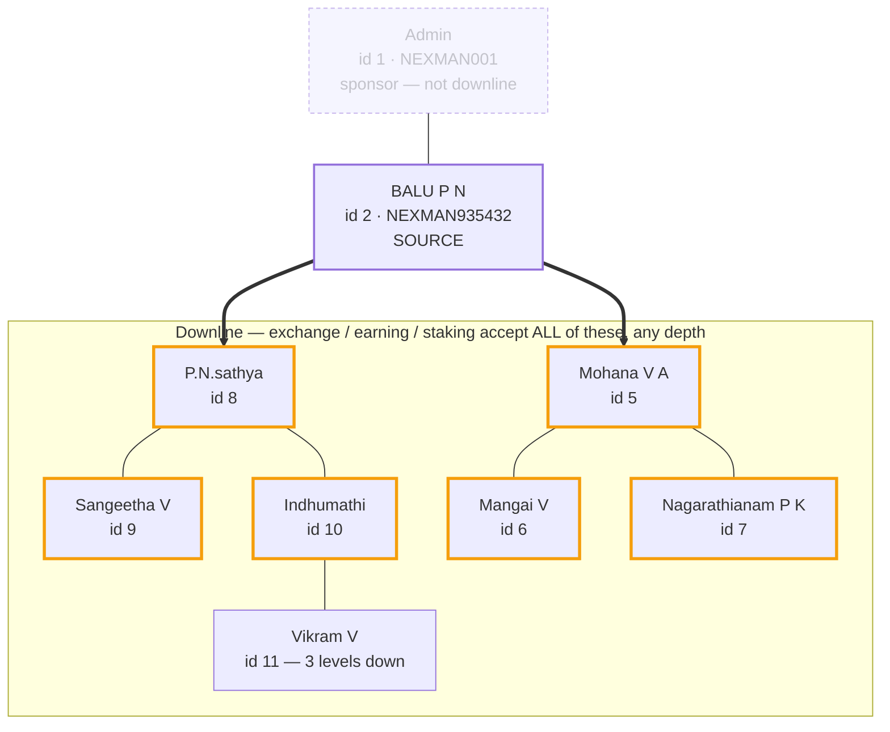

# 2026-08-27 — Wallet Transfer Engine · exchange / earning / staking → downline, any depth

Companion to the bonus-wallet docs from earlier today
([27_08_26_bonus_transfer_rule_1.md](27_08_26_bonus_transfer_rule_1.md) ·
[27_08_26_bonus_transfer_rule_2.md](27_08_26_bonus_transfer_rule_2.md)):
rechecking and mapping the **other three wallets'** rule, which those docs
mention but never verified or drew on its own. Nothing changed here — this is
verification of long-standing, unchanged behavior.

Engine doc: [16_WALLET_TRANSFER_ENGINE.md](16_WALLET_TRANSFER_ENGINE.md) ·
Changelog: [3_CHANGELOG.md](3_CHANGELOG.md).

---

## 1. The rule

| Source wallet | Eligible recipient | Depth limit |
|---|---|---|
| `exchange` / `earning` / `staking` | **any member in the source's downline** | **none — any depth** |
| `bonus` | left/right binary leg only | 2 levels (see the bonus docs) |

"Downline" here is the **sponsor tree** (`users.sponser`, walked by
`isInDownline()` / `downlineIds()`) — a different tree from the binary
placement (`binary_placement.parent_id`) that bonus reads. In the current
dataset every `sponser` happens to equal the matching `binary_placement`
parent, so the two trees agree member-for-member; they are not guaranteed to
stay that way (see bonus doc §3 for the spillover case where they'd diverge).

**No depth cap.** A member ten levels down is exactly as eligible as a direct
child, as long as they're somewhere in the chain below the source. This is the
one substantive difference from bonus, and the reason this doc exists
alongside it.

---

## 2. Map — downline reach vs. bonus's zone, same tree



The whole box is the downline — every node in it is a valid `exchange` /
`earning` / `staking` recipient for source id 2, no matter how deep. The
amber-bordered six are the ones bonus *also* reaches (its 2-level zone).
**id 11 Vikram V is the one member downline reaches that bonus does not** —
plain-bordered, inside the downline box but outside bonus's zone, at 3 hops.
Nothing outside the box (the sponsor above, any other branch) is eligible for
any of these four wallets.

---

## 3. Verified

Fresh, live checks today — not carried over from earlier. Two independent
paths, same result both times:

**Admin-side engine, source id 2** (`admin/finance/internal-transfers/preview`
and `.../recipients`):

| Wallet | Recipient | Relationship | Result |
|---|---|---|---|
| `exchange` | id 5–11 (all 7) | downline | picker returns all 7 |
| `earning` | id 5–11 (all 7) | downline | picker returns all 7 |
| `staking` | id 5–11 (all 7) | downline | picker returns all 7 |
| `earning` | id 11 Vikram V | 3 levels down | **ALLOWED** (`ok`) |
| `staking` | id 11 Vikram V | 3 levels down | **ALLOWED** (`ok`) |
| `exchange` | id 11 Vikram V | 3 levels down | rule passes, `insufficient_balance` (source's exchange balance is 0 — not a rule rejection) |
| `exchange` / `earning` / `staking` | id 1 Admin | sponsor, not downline | **BLOCKED** (`recipient_not_in_downline`) |
| `exchange` | id 3 BALU P N | sibling branch | **BLOCKED** (`recipient_not_in_downline`) |

**User-side page itself**, `user/transfer_wallet`, driven end-to-end as the
real logged-in member (id 2) — clicked "Send to a Member", selected each
wallet, read the actual rendered dropdown:

- `exchange`: 7 results in the DOM — `NEXMAN715985, NEXMAN831941,
  NEXMAN992152, NEXMAN591373, NEXMAN397920, NEXMAN471834, NEXMAN767566`
  (id 11 Vikram's referral id is the last one — confirmed present).
- `earning` / `staking`: identical 7-member set via the live
  `search_recipients` endpoint.

Same answer through the admin proxy and the real member-facing page, because
both call the one shared engine.

---

## 4. Implementation (unchanged — cited for completeness)

`application/models/wallet/Wallettransferservice_model.php`:

```php
public function memberRule($wallet)
{
    if (in_array($wallet, ['exchange','earning','staking'], true)) return 'downline';
    if ($wallet === 'bonus') return 'binary_leg_downline';
    return null;
}
```

- `downlineIds($sourceId)` — BFS down the sponsor tree. `users.sponser` may
  hold either a numeric id or a referral id, so each level matches children by
  both, capped at depth 100 / 5000 members as a safety bound (not a business
  rule — no real tree gets remotely close).
- `isInDownline($sourceId, $recipientId)` — walks the sponsor chain **up**
  from the candidate, cycle-guarded, used by `validate()`'s rejection check.
- Both existed before today; nothing in this doc's verification required a
  code change.

---

## 5. Files

Nothing in `application/` changed for this doc — pure verification of
existing behavior, live-tested through both the admin engine and the real
member page.

| File | What |
|---|---|
| `application/controllers/ZzTestLogin.php` | added a `user($userId)` method (mirrors the existing `admin()` one) so this and future sessions can drive real member-facing pages without credentials. **Dev-only, never committed** — same rule as the rest of this file. |
| `docs/27_08_26_downline_wallet_transfer_rule.md` | this doc |

**Apply:** nothing to deploy — no code changed outside the local dev harness.
