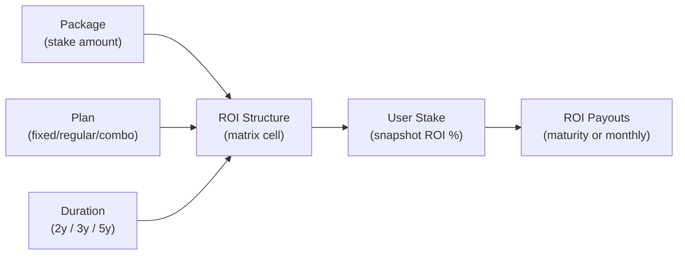
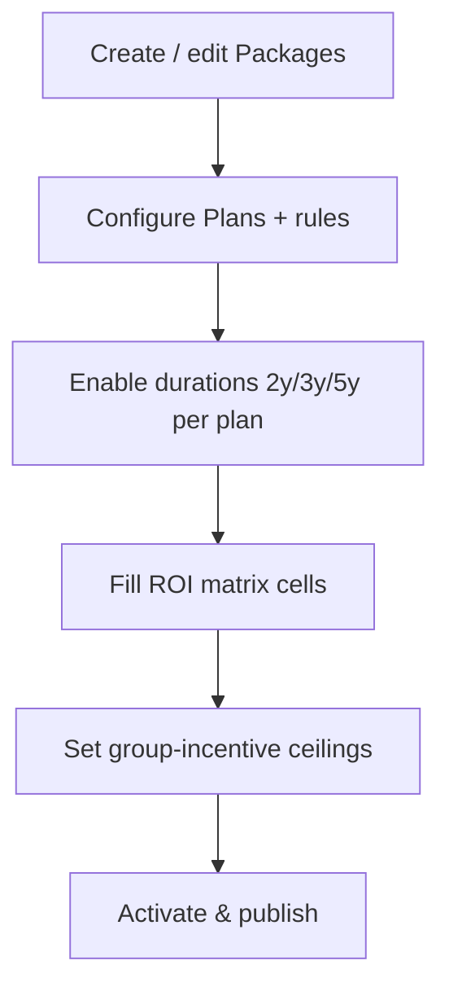
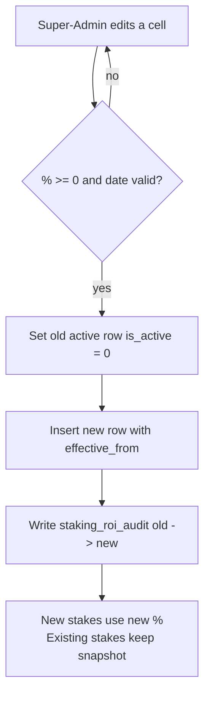
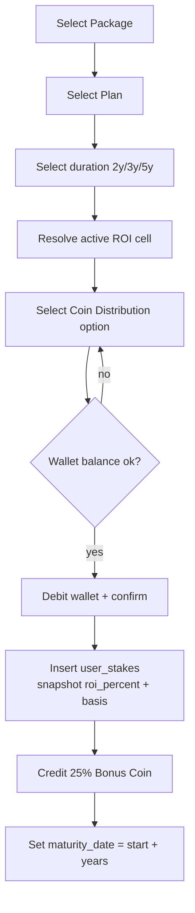
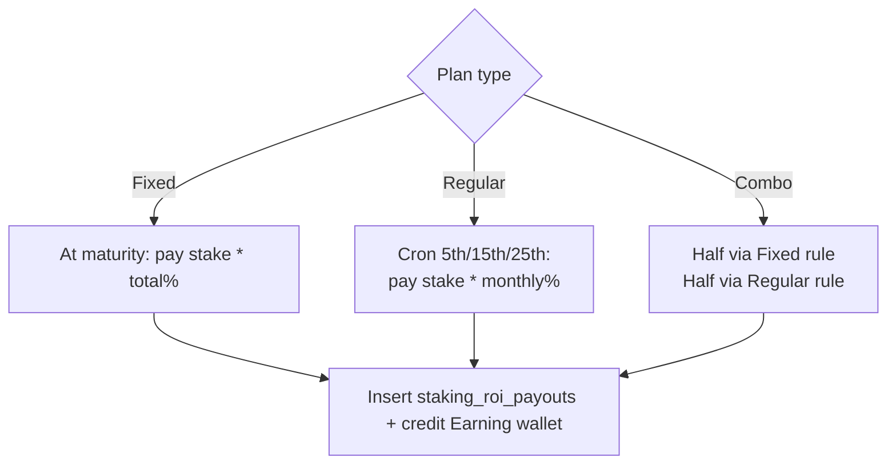

# 6 — Staking: Packages, Plans & ROI Structure (Pre‑Plan)

Design/pre-plan for managing **Staking Packages**, **Staking Plans** and the
**ROI Structure** for the BMAN platform, derived from
`Client_requirements/BMAN STAKING MASTER PROPOSAL DETAILS.pdf` (§4 Packages,
§5 Plans, §6 ROI, §7 Bonus, §12 Group Ceiling).

> Status: **admin side delivered** (2026-07-02) — tables created + seeded.
> Live screens: **Admin → Staking Management** (Packages · Plans · ROI
> Structure · Rank Achievement · Rank Power & Incentive · Bonus & Matching),
> **Admin → Master → Coin Distribution** (§3A) and the single
> **Withdraw Settings** page (global + staking plan rules). User purchase
> flow, engines/crons and reports remain planned — see the task board in
> [0_INDEX.md](0_INDEX.md). Links:
> [0_INDEX.md](0_INDEX.md) · [3_CHANGELOG.md](3_CHANGELOG.md).
> Legend: ✅ done · 🟡 in progress · ⬜ planned.

---

## 1. Concept — how the three pieces relate

A **Package** is a fixed stake amount (5,000 … 500,000 BMAN). A **Plan** is *how*
the stake earns (Fixed / Regular / Combo) and for how long (2 / 3 / 5 years). The
**ROI Structure** is the matrix that says, for a given *package × plan × duration*,
what the return is. When a user stakes, we resolve one ROI value from that matrix
and **snapshot** it onto the stake (so later admin edits never change live stakes).



**Key rule:** ROI % is read from the matrix **once**, at purchase, and copied to
`user_stakes.roi_percent`. Business rule from the proposal: *distribution/params
locked after transaction confirmation*.

---

## 2. Existing vs new tables

| Existing (legacy, keep) | Why not reused |
|---|---|
| `package_config` | Generic single-package MLM config (`roi`, `duration` are `varchar`); can't hold a 9×2×3 matrix |
| `user_investment` | Loosely-typed legacy investment log (`varchar` amounts) |
| `token_config` | Holds the BMAN coin/symbol — **reuse** for coin metadata |

**Proposal:** add dedicated, strongly-typed tables (`staking_packages`,
`staking_plans`, `staking_plan_terms`, `staking_roi_structure`,
`staking_roi_audit`, `user_stakes`, `staking_roi_payouts`). Legacy tables stay
untouched → backward compatible.

---

## 3. Field definitions

### 3.1 Staking Package fields

| Field | Type | Notes |
|---|---|---|
| `name` | string | Display name, e.g. `5,000 BMAN` |
| `stake_amount` | decimal | The BMAN amount (unique) |
| `bonus_percent` | decimal | Staking bonus coin % (default **25**, §7) |
| `group_ceiling` | decimal | Group incentive ceiling (§12) |
| `sort_order` | int | Display order |
| `is_active` | bool | Enable / disable |

### 3.2 Staking Plan fields

| Field | Type | Notes |
|---|---|---|
| `name` / `code` | string / enum | `Fixed` `Regular` `Combo` |
| `roi_credit_mode` | enum | `maturity` (Fixed) · `monthly` (Regular) · `mixed` (Combo) |
| `credit_days` | string | Regular credit dates → `5,15,25` (§5) |
| `withdraw_after_maturity` | bool | Fixed = withdraw only at maturity |
| `withdraw_frequency_days` | int | Regular = `30` (withdraw window) |
| `min/max_withdraw_bman` | decimal | `3000` / `10000` (admin adjustable, §5) |
| `min/max_withdraw_usdt` | decimal | `30` / `100` (admin adjustable, §5) |
| `combo_fixed_pct` / `combo_regular_pct` | decimal | `50` / `50` (§5) |
| `is_active` | bool | Enable / disable |

**Durations** (`staking_plan_terms`): `plan_id`, `duration_years` (2/3/5), `is_active`.

### 3.3 ROI Structure fields (the matrix)

| Field | Type | Notes |
|---|---|---|
| `package_id` | FK | → `staking_packages` |
| `plan_code` | enum | `fixed` · `regular` (Combo is derived 50/50) |
| `duration_years` | tinyint | 2 · 3 · 5 |
| `roi_percent` | decimal(8,3) | e.g. `150.000` (Fixed total) / `2.300` (Regular monthly) |
| `roi_basis` | enum | `total` (Fixed, whole term) · `monthly` (Regular, per month) |
| `effective_from` | date | Version start; enables history |
| `is_active` | bool | Current row for that cell |
| `created_by` | int | Super-Admin id (audit) |

---

## 4. MySQL table structures (DDL)

```sql
-- 4.1 Packages
CREATE TABLE `staking_packages` (
  `id` INT UNSIGNED NOT NULL AUTO_INCREMENT,
  `name` VARCHAR(80) NOT NULL,
  `stake_amount` DECIMAL(20,4) NOT NULL,
  `bonus_percent` DECIMAL(6,2) NOT NULL DEFAULT 25.00,
  `group_ceiling` DECIMAL(20,4) NOT NULL DEFAULT 0,
  `sort_order` INT NOT NULL DEFAULT 0,
  `is_active` TINYINT(1) NOT NULL DEFAULT 1,
  `created_at` DATETIME NOT NULL DEFAULT CURRENT_TIMESTAMP,
  `updated_at` DATETIME NOT NULL DEFAULT CURRENT_TIMESTAMP ON UPDATE CURRENT_TIMESTAMP,
  PRIMARY KEY (`id`),
  UNIQUE KEY `uq_amount` (`stake_amount`)
) ENGINE=InnoDB DEFAULT CHARSET=utf8mb4;

-- 4.2 Plans
CREATE TABLE `staking_plans` (
  `id` INT UNSIGNED NOT NULL AUTO_INCREMENT,
  `name` VARCHAR(60) NOT NULL,
  `code` ENUM('fixed','regular','combo') NOT NULL,
  `roi_credit_mode` ENUM('maturity','monthly','mixed') NOT NULL,
  `credit_days` VARCHAR(40) DEFAULT NULL,            -- "5,15,25"
  `withdraw_after_maturity` TINYINT(1) NOT NULL DEFAULT 0,
  `withdraw_frequency_days` INT NOT NULL DEFAULT 0,  -- 30 for Regular
  `min_withdraw_bman` DECIMAL(20,4) DEFAULT NULL,    -- 3000
  `max_withdraw_bman` DECIMAL(20,4) DEFAULT NULL,    -- 10000
  `min_withdraw_usdt` DECIMAL(20,4) DEFAULT NULL,    -- 30
  `max_withdraw_usdt` DECIMAL(20,4) DEFAULT NULL,    -- 100
  `combo_fixed_pct` DECIMAL(6,2) DEFAULT NULL,       -- 50
  `combo_regular_pct` DECIMAL(6,2) DEFAULT NULL,     -- 50
  `sort_order` INT NOT NULL DEFAULT 0,
  `is_active` TINYINT(1) NOT NULL DEFAULT 1,
  `created_at` DATETIME NOT NULL DEFAULT CURRENT_TIMESTAMP,
  `updated_at` DATETIME NOT NULL DEFAULT CURRENT_TIMESTAMP ON UPDATE CURRENT_TIMESTAMP,
  PRIMARY KEY (`id`),
  UNIQUE KEY `uq_code` (`code`)
) ENGINE=InnoDB DEFAULT CHARSET=utf8mb4;

-- 4.3 Durations available per plan
CREATE TABLE `staking_plan_terms` (
  `id` INT UNSIGNED NOT NULL AUTO_INCREMENT,
  `plan_id` INT UNSIGNED NOT NULL,
  `duration_years` TINYINT NOT NULL,                 -- 2,3,5
  `is_active` TINYINT(1) NOT NULL DEFAULT 1,
  PRIMARY KEY (`id`),
  UNIQUE KEY `uq_plan_term` (`plan_id`,`duration_years`),
  CONSTRAINT `fk_term_plan` FOREIGN KEY (`plan_id`) REFERENCES `staking_plans`(`id`)
) ENGINE=InnoDB DEFAULT CHARSET=utf8mb4;

-- 4.4 ROI matrix (package × plan × duration), effective-dated
CREATE TABLE `staking_roi_structure` (
  `id` INT UNSIGNED NOT NULL AUTO_INCREMENT,
  `package_id` INT UNSIGNED NOT NULL,
  `plan_code` ENUM('fixed','regular') NOT NULL,
  `duration_years` TINYINT NOT NULL,
  `roi_percent` DECIMAL(8,3) NOT NULL,
  `roi_basis` ENUM('total','monthly') NOT NULL,
  `effective_from` DATE NOT NULL,
  `is_active` TINYINT(1) NOT NULL DEFAULT 1,
  `created_by` INT DEFAULT NULL,
  `created_at` DATETIME NOT NULL DEFAULT CURRENT_TIMESTAMP,
  `updated_at` DATETIME NOT NULL DEFAULT CURRENT_TIMESTAMP ON UPDATE CURRENT_TIMESTAMP,
  PRIMARY KEY (`id`),
  KEY `idx_lookup` (`package_id`,`plan_code`,`duration_years`,`is_active`,`effective_from`),
  CONSTRAINT `fk_roi_pkg` FOREIGN KEY (`package_id`) REFERENCES `staking_packages`(`id`)
) ENGINE=InnoDB DEFAULT CHARSET=utf8mb4;

-- 4.5 Audit trail for ROI edits (Super-Admin only, per proposal business rules)
CREATE TABLE `staking_roi_audit` (
  `id` BIGINT UNSIGNED NOT NULL AUTO_INCREMENT,
  `roi_id` INT UNSIGNED DEFAULT NULL,
  `package_id` INT UNSIGNED NOT NULL,
  `plan_code` VARCHAR(10) NOT NULL,
  `duration_years` TINYINT NOT NULL,
  `old_percent` DECIMAL(8,3) DEFAULT NULL,
  `new_percent` DECIMAL(8,3) NOT NULL,
  `changed_by` INT NOT NULL,
  `note` VARCHAR(255) DEFAULT NULL,
  `created_at` DATETIME NOT NULL DEFAULT CURRENT_TIMESTAMP,
  PRIMARY KEY (`id`)
) ENGINE=InnoDB DEFAULT CHARSET=utf8mb4;

-- 4.6 User stake (snapshots ROI at purchase — locked)
CREATE TABLE `user_stakes` (
  `id` BIGINT UNSIGNED NOT NULL AUTO_INCREMENT,
  `user_id` INT NOT NULL,
  `package_id` INT UNSIGNED NOT NULL,
  `plan_id` INT UNSIGNED NOT NULL,
  `plan_code` ENUM('fixed','regular','combo') NOT NULL,
  `duration_years` TINYINT NOT NULL,
  `stake_amount` DECIMAL(20,4) NOT NULL,
  `roi_percent` DECIMAL(8,3) NOT NULL,               -- snapshot
  `roi_basis` ENUM('total','monthly') NOT NULL,
  `bonus_amount` DECIMAL(20,4) NOT NULL DEFAULT 0,   -- 25% bonus coin
  `distribution_option_id` INT DEFAULT NULL,         -- §3A coin distribution
  `start_date` DATE NOT NULL,
  `maturity_date` DATE NOT NULL,
  `status` ENUM('active','matured','withdrawn','cancelled') NOT NULL DEFAULT 'active',
  `created_at` DATETIME NOT NULL DEFAULT CURRENT_TIMESTAMP,
  PRIMARY KEY (`id`),
  KEY `idx_user` (`user_id`),
  KEY `idx_status` (`status`)
) ENGINE=InnoDB DEFAULT CHARSET=utf8mb4;

-- 4.7 ROI credit history (maturity or monthly)
CREATE TABLE `staking_roi_payouts` (
  `id` BIGINT UNSIGNED NOT NULL AUTO_INCREMENT,
  `stake_id` BIGINT UNSIGNED NOT NULL,
  `user_id` INT NOT NULL,
  `amount` DECIMAL(20,4) NOT NULL,
  `credit_date` DATE NOT NULL,
  `wallet` ENUM('earning','staking') NOT NULL DEFAULT 'earning',
  `status` ENUM('pending','paid','failed') NOT NULL DEFAULT 'paid',
  `created_at` DATETIME NOT NULL DEFAULT CURRENT_TIMESTAMP,
  PRIMARY KEY (`id`),
  KEY `idx_stake` (`stake_id`)
) ENGINE=InnoDB DEFAULT CHARSET=utf8mb4;
```

---

## 5. Seed data (from the proposal)

### 5.1 Packages (§4 + §12 ceiling + §7 bonus)

| name | stake_amount | bonus_% | group_ceiling |
|---|--:|--:|--:|
| 5,000 BMAN | 5,000 | 25 | 5,000 |
| 10,000 BMAN | 10,000 | 25 | 10,000 |
| 20,000 BMAN | 20,000 | 25 | 20,000 |
| 25,000 BMAN | 25,000 | 25 | 25,000 |
| 50,000 BMAN | 50,000 | 25 | 30,000 |
| 100,000 BMAN | 100,000 | 25 | 30,000 |
| 200,000 BMAN | 200,000 | 25 | 50,000 |
| 300,000 BMAN | 300,000 | 25 | 70,000 |
| 500,000 BMAN | 500,000 | 25 | 100,000 |

### 5.2 Plans (§5)

| code | credit_mode | credit_days | withdraw rule | durations |
|---|---|---|---|---|
| fixed | maturity | — | after maturity only | 2, 3, 5 |
| regular | monthly | 5,15,25 | 30-day window, 3000–10000 BMAN (30–100 USDT) | 2, 3, 5 |
| combo | mixed | 5,15,25 | 50% fixed + 50% regular | 2, 3, 5 |

### 5.3 ROI matrix (§6) — `roi_percent` / `roi_basis`

| Stake | Fixed 2Y | Fixed 3Y | Fixed 5Y | Regular 2Y | Regular 3Y | Regular 5Y |
|---:|--:|--:|--:|--:|--:|--:|
| 5,000 | 150% | 200% | 400% | 2.3% | 2.5% | 3.0% |
| 10,000 | 150% | 200% | 400% | 2.3% | 2.5% | 3.0% |
| 20,000 | 150% | 200% | 400% | 2.3% | 2.5% | 3.0% |
| 25,000 | 150% | 200% | 400% | 2.3% | 2.5% | 3.0% |
| 50,000 | 150% | 200% | 400% | 2.3% | 2.5% | 3.0% |
| 100,000 | 150% | 200% | 400% | 2.3% | 2.5% | 3.0% |
| 200,000 | 160% | 210% | 410% | 2.5% | 3.2% | 3.2% |
| 300,000 | 180% | 230% | 430% | 2.8% | 3.3% | 3.3% |
| 500,000 | 200% | 250% | 450% | 3.0% | 3.5% | 3.5% |

Fixed columns → `roi_basis = total` (whole term). Regular columns →
`roi_basis = monthly` (per-month). Combo is computed 50/50 from the two.

---

## 6. User-friendly management (admin UX)

Three admin screens under **Admin → Staking** (reuse the existing Metronic admin
layout & `admin/settings/*` pattern):

1. **Packages** — simple table CRUD: add/edit amount, bonus %, ceiling, drag to
   reorder, one-click enable/disable. Delete blocked if stakes exist (soft
   disable instead).
2. **Plans** — one card per plan (Fixed / Regular / Combo) with its rule fields;
   tick which durations (2/3/5) are offered. *(Update 2026-07-02: the withdraw
   window and min/max fields are edited on the single **Withdraw Settings**
   page — the Plans cards show them read-only with a link, so withdraw config
   is never split across two pages.)*
3. **ROI Structure** — the centrepiece: an **inline-editable grid** that mirrors
   the proposal table (rows = packages, columns = Fixed 2/3/5 + Regular 2/3/5).
   Type a new number → cell turns amber (unsaved) → **Save** writes a new
   effective-dated row + an audit entry. Super-Admin only.

**Why this is safe & friendly**
- One grid = the whole ROI config at a glance (matches the PDF exactly).
- **Effective dating**: edits create a new versioned row; the old one stays for
  history. New stakes use the new %, live stakes keep their snapshot.
- **Audit**: every % change writes `staking_roi_audit` (old → new, who, when).
- **Guardrails**: % must be ≥ 0; Combo split must total 100; a package can't be
  deleted while it has active stakes.

---

## 7. Flowcharts

### 7.1 Admin configuration order


### 7.2 ROI edit (versioned + audited)


### 7.3 User stake purchase → ROI resolution


### 7.4 ROI credit engine


---

## 8. Sample admin pages (wireframes)

### 8.1 Packages
```
Admin ▸ Staking ▸ Packages                              [ + Add Package ]
┌────┬───────────────┬──────────────┬────────┬──────────┬────────┬─────────┐
│ ⇅  │ Name          │ Stake (BMAN) │ Bonus% │ Ceiling  │ Active │ Actions │
├────┼───────────────┼──────────────┼────────┼──────────┼────────┼─────────┤
│ ⠿  │ 5,000 BMAN    │        5,000 │   25   │   5,000  │  [on]  │ ✎  🗑   │
│ ⠿  │ 10,000 BMAN   │       10,000 │   25   │  10,000  │  [on]  │ ✎  🗑   │
│ ⠿  │ …             │          …   │   …    │    …     │   …    │  …      │
└────┴───────────────┴──────────────┴────────┴──────────┴────────┴─────────┘
```

### 8.2 Plans
```
Admin ▸ Staking ▸ Plans
┌─ Fixed ──────────────────┐ ┌─ Regular ────────────────┐ ┌─ Combo ───────────┐
│ Credit: at maturity      │ │ Credit days: 5, 15, 25   │ │ Fixed 50 / Reg 50 │
│ Durations: ☑2 ☑3 ☑5      │ │ Withdraw window: 30 days │ │ Durations: ☑2☑3☑5 │
│ Withdraw: maturity only  │ │ Min/Max BMAN: 3000/10000 │ │ [Active ●]        │
│ [Active ●]               │ │ Min/Max USDT:  30 / 100  │ │                   │
└──────────────────────────┘ │ [Active ●]               │ └───────────────────┘
                             └──────────────────────────┘
```

### 8.3 ROI Structure (inline-editable grid)
```
Admin ▸ Staking ▸ ROI Structure     Effective from: [2026-07-01]  (Super-Admin)
┌───────────┬────────┬────────┬────────┬─────────┬─────────┬─────────┐
│ Stake     │ Fix 2Y │ Fix 3Y │ Fix 5Y │ Reg 2Y  │ Reg 3Y  │ Reg 5Y  │
├───────────┼────────┼────────┼────────┼─────────┼─────────┼─────────┤
│ 5,000     │[150.0 ]│[200.0 ]│[400.0 ]│[ 2.30 ] │[ 2.50 ] │[ 3.00 ] │
│ 200,000   │[160.0 ]│[210.0 ]│[410.0 ]│[ 2.50 ] │[ 3.20 ] │[ 3.20 ] │
│ 500,000   │[200.0 ]│[250.0 ]│[450.0 ]│[ 3.00 ] │[ 3.50 ] │[ 3.50 ] │
└───────────┴────────┴────────┴────────┴─────────┴─────────┴─────────┘
 Fix = total % over term   Reg = % per month     [ Save changes ]  [ View history ]
```

---

## 9. Business rules & validation

- ROI % `>= 0`; Fixed basis = `total`, Regular basis = `monthly`.
- Combo `fixed_pct + regular_pct = 100`.
- Regular withdraw: 30-day window, 3000–10000 BMAN (30–100 USDT), **admin
  adjustable** (proposal note "we need to increase or decrease").
- ROI is **snapshotted** at purchase and never back-changed.
- ROI edits: Super-Admin only, versioned + audited.
- A package with active stakes cannot be deleted (only disabled).
- Every stake grants **25% Bonus Coin** (§7); bonus wallet auto-reduces 50%
  every 60 days (separate engine).

---

## 10. Implementation checklist (CI3, matches existing structure)

- ✅ Migration: 7 tables (§4) **+ 2 rank tables** (`staking_ranks`,
  `staking_rank_requirements`) + seed (§5 + proposal §10) —
  `db/staking_module.sql` (idempotent, applied to `e-commerce-mlm-v2`)
- ✅ Model `Staking_model` — packages/plans CRUD, `resolveRoi($pkg,$plan,$dur)`
  (combo returns both halves), versioned ROI write + audit, plan-term toggles,
  ranks CRUD + qualification-requirements editor
- ✅ Controllers `admin/staking/Packages`, `admin/staking/Plans`,
  `admin/staking/Roistructure`, `admin/staking/Ranks` (session guard +
  `staking_management` permission; ROI saves additionally need
  `staking_roi_edit` for restricted sub-admins — Super-Admin-only rule)
- ✅ Views (Metronic, `views/admin/staking/*`): packages table (add/edit modal,
  ▲▼ reorder, enable/disable, guarded delete), plans cards (withdraw rules,
  credit days, combo split live-sum, duration ticks), ROI grid editor (amber
  dirty cells → bulk AJAX save, per-cell version history modal, audit-log
  modal), ranks table (incentive/benefits modal + Plan-1/2/3 requirements
  editor with OR-options)
- ✅ Routes under `admin/staking/*` + sidebar group **Staking Management**
- ⬜ User purchase flow writes `user_stakes` (snapshot) + 25% bonus
- ⬜ Cron: Regular/Combo monthly credit (5/15/25) + Fixed maturity credit → `staking_roi_payouts`
- ⬜ Reports: Staking report, ROI paid report (PDF/Excel/CSV per §18)

### 10.1 Rank Achievement admin (proposal §10) — delivered with this phase

- 11 permanent ranks seeded (UN RANK → CHALLENGER) with group incentives
  (1,000 → 5,00,00,000) in `staking_ranks`.
- Qualification matrix seeded in `staking_rank_requirements`: per rank up to
  three alternative plans; rows in the same `(plan_no, option_no)` are AND-ed
  (Left + Right), different `option_no` inside a plan are OR options (used for
  PLATINUM Plan-1: *L2+R1 GOLD or L1+R2 GOLD*).
- Benefits flags per rank: Badge / Certificate / Reward / Recognition
  (+ badge colour), all editable; ranks can be enabled/disabled.
- Achievement *evaluation engine* (cron that scans the binary tree and awards
  ranks) is part of the user-side phase, not this admin phase.

### 10.2 Rank Power System (§11) & Group Incentive Ceiling (§12) — admin side

Screen **Admin → Staking Management → Rank Power & Incentive**
(`admin/staking/rank-power`), delivered 2026-07-02. SQL:
`db/staking_rank_power.sql` (idempotent).

- **Rules config** (`staking_rank_power_settings`, single row): system
  enable/disable, reset cycle in days (default **60**, §11), whether power
  rank *controls group-incentive qualification*, minimum power tier required
  to qualify (0 = any), auto-open-next-cycle flag for the future cron.
- **Cycle management** (`staking_rank_power_cycles`): current-cycle card with
  days remaining, cycle history with member counts, and a **Reset Now**
  button — closes the open cycle (everyone's power rank resets, §11) and
  opens the next window of `cycle_days`.
- **Per-user power** (`user_rank_power`): one row per user per cycle
  (`power_rank_id` reuses the `staking_ranks` tier scale + `qualified` flag).
  Created now for the evaluation engine; filled in the user-side phase.
- **Group Incentive Ceiling editor** (§12): amber-dirty inline grid of
  stake → ceiling. Values live on `staking_packages.group_ceiling` (same field
  the Packages screen edits), so there is a single source of truth.
- Rank Power is intentionally **separate from Achievement Rank** — achievement
  ranks are permanent (`staking_ranks` + user assignment later), power ranks
  exist only inside a cycle and vanish on reset.

### 10.3 Bonus Coin System (§7) & Binary Matching Bonus (§9) — admin side

Screen **Admin → Staking Management → Bonus & Matching**
(`admin/staking/bonus-settings`), delivered 2026-07-02. SQL:
`db/staking_bonus_settings.sql` (idempotent, single-row settings).

- **Staking Bonus (§7):** global default bonus % (25) with an *apply to all
  packages* helper; per-package override stays on the Packages screen.
- **Bonus Reduction (§7):** enable/disable + interval days (60) + reduction %
  (50) — the future bonus-wallet reduction cron reads these.
- **Bonus Transfer (§7):** enable/disable, allowed recipients (direct Left /
  direct Right sponsored member), security toggles (email OTP, transfer
  password). Guard: transfer can't be enabled with both sides disallowed.
- **Binary Matching Bonus (§9):** total % (10) split into Earning Coin % (8)
  + Staking Coin % (2); live sum hint + server guard *earning + staking =
  total*.
- §8 (Binary MLM) needs no new admin settings — tree/genealogy/team views are
  existing platform features.

With this, **all admin-side setups for proposal §4–§12 are complete**
(§4 Packages · §5 Plans · §6 ROI · §7 Bonus · §9 Matching · §10 Ranks ·
§11 Rank Power · §12 Ceiling). Remaining work is user-side + engines
(purchase flow, ROI credit cron, bonus reduction cron, rank/power evaluation,
matching payout, reports).

### 10.4 Coin Distribution Master (§3A) — delivered 2026-07-02

Screen **Admin → Master → Coin Distribution**
(`admin/master/coin-distribution`). SQL: `db/coin_distribution.sql`.

- 7 allocation options seeded (Exchange/Earning/Staking/Bonus %, each = 100,
  Option 1 default). List page with Status/Default filters, search, CSV
  export; add/edit modal with a live total-must-be-100 check.
- Rules: only one default (auto-clears the previous); the default can't be
  disabled or deleted; options used by purchases can't be deleted; Super
  Admin (`admin_roll = 1`) adds/edits/deletes/sets default, other admins
  view + enable/disable. Every change → `coin_distribution_audit`.
- Purchase integration: Make-Investment has an option selector + live split
  preview; confirmation snapshots option id + percentages + amounts into
  `coin_distribution_histories` and credits the four wallets via the
  extended `wallet_transactions` ledger (`source='coin_distribution'`).

### 10.5 Single Withdraw Settings page — delivered 2026-07-02

`withdraw-settings` is the **only** withdraw page: global rules (status,
min/max, fee, daily/monthly limits, %-or-fiat, notifications) plus a
**Staking Plan Withdraw Rules (BMAN)** card for the Regular/Combo window and
min/max BMAN/USDT (saved via `admin/staking/plans/save/{id}`). The Staking
Plans page shows these read-only with a link. No SQL change.

> **Task tracking:** the working task board for the remaining phases lives in
> [0_INDEX.md](0_INDEX.md) → *Task board — BMAN Staking project*. Every landed
> change is also logged in [3_CHANGELOG.md](3_CHANGELOG.md) with files +
> how-to-apply.
