# BMAN Ranks — What You Earn, and How

A plain-English guide for members. Everything here reflects exactly what the system
actually does.

---

## The 11 ranks

| | Rank | Team volume to reach it |
|---|---|---:|
| 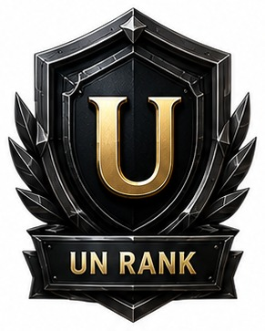 | **UN RANK** | 1,000 BMAN |
| 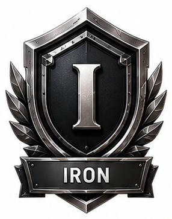 | **IRON** | 7,500 |
| 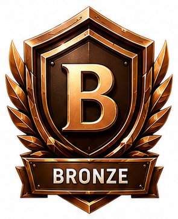 | **BRONZE** | 30,000 |
| 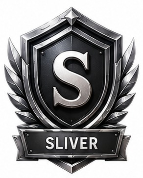 | **SILVER** | 1,50,000 |
| 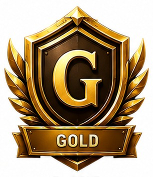 | **GOLD** | 6,00,000 |
| 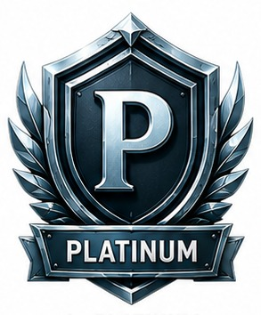 | **PLATINUM** | 25,00,000 |
| 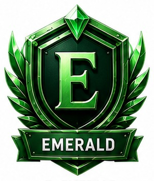 | **EMERALD** | 1,00,00,000 |
| 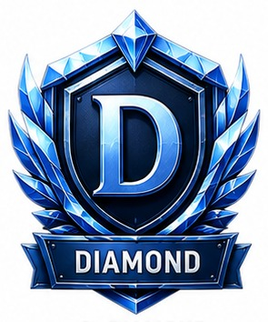 | **DIAMOND** | 2,00,00,000 |
| 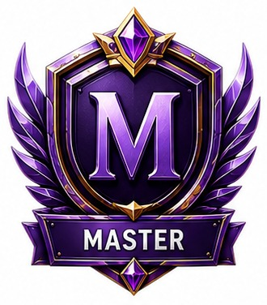 | **MASTER** | 3,00,00,000 |
| 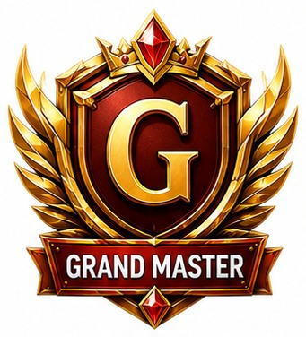 | **GRANDMASTER** | 4,00,00,000 |
| 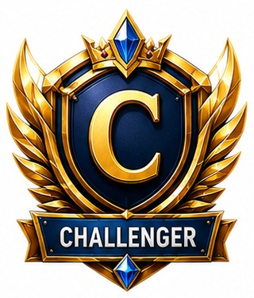 | **CHALLENGER** | 5,00,00,000 |

---

## Your four benefits

Every rank you reach unlocks:

### 🏅 Rank Badge
Your badge appears on your dashboard, your profile, the genealogy tree, the
leaderboard, and anywhere your name is shown. It is how your team sees what you've
built.

### 📜 Rank Certificate
A formal certificate with a unique number — for example **`BMAN-GOLD-2026-000001`**.
The number is issued in order, per rank, per year: the first GOLD of the year really
is `000001`. It carries your name, your rank and the date, and you can print it or
save it as a PDF at any time.

### 🎁 Rank Reward
A one-time reward when you reach the rank. It lands in your wallet automatically —
you don't claim it, and you don't wait on anyone to approve it.

### 🌟 Rank Recognition
Your position on the leaderboard, ranked by what you've achieved.

---

## The one thing that matters most: **your rank is permanent**

> **Once you earn a rank, it is yours forever.**

Reach GOLD, and you are GOLD. If your team's volume later drops — even to zero —
**you are still GOLD**. There is no demotion. There is no expiry. There is no
"maintain it or lose it".

This isn't a promise in a document; it's how the software is built. The system
physically has no code path that lowers a rank. It can only ever move you up.

What you build, you keep.

---

## How you reach a rank

Two things have to be true:

### 1. Your team volume

Team volume is the **completed staking of everyone below you**, across your whole
team, to unlimited depth — not just the people you personally referred.

Two things to know:

- **Your own staking doesn't count.** Ranks measure what you've *built*, not what
  you've bought.
- **Only completed staking counts.** Pending, failed, cancelled and refunded orders
  are never included.

### 2. Your team structure — and you get **three routes**

You need qualified members on your **left** and **right** legs. There are **three
alternative plans** for every rank, and **you only need to satisfy ONE of them** —
whichever fits the team you've actually built.

Taking **PLATINUM** as the example:

| Route | What you need |
|---|---|
| **Plan 1** | Left 2 GOLD + Right 1 GOLD — **or** — Left 1 GOLD + Right 2 GOLD |
| **Plan 2** | Left 2 GOLD + Right 6 SILVER |
| **Plan 3** | Left 6 SILVER + Right 2 GOLD |

Any one of these makes you PLATINUM. Note Plan 1 itself has two options — the system
doesn't care which leg is stronger.

**A higher rank always counts for a lower one.** If a rank asks for "2 GOLD" and you
have 2 DIAMONDs there, that's covered.

**Your whole leg counts, at any depth.** If you need 2 GOLD on the left, a GOLD
twelve levels down still counts. You are never punished for depth.

---

## Rank Power — the part people mix up

Alongside your permanent rank there's a second, separate thing called **Rank Power**.

|  | **Your Rank** | **Your Rank Power** |
|---|---|---|
| Based on | everything you've ever built | **only the last 60 days** |
| Lasts | **forever** | resets every 60 days |
| Gives you | badge, certificate, reward, recognition | **your Group Incentive** |

**Group Incentive is paid on your Rank Power, not on your permanent rank.**

Worked example:

> Your rank is **GOLD** — permanently, on your dashboard, on your certificate.
> But this 60-day cycle your team did SILVER-level volume.
> → Your Group Incentive this cycle is paid at **SILVER**.
> → You are **still GOLD**. That never changes.

**Why it works this way:** your permanent rank honours what you've built and can
never be taken away. Rank Power keeps the ongoing income tied to ongoing activity.
Every 60 days the clock resets and everyone starts level — so a strong cycle is
always worth having, no matter how long you've been here.

You can see your current cycle, your volume in it, and the day it resets on your
dashboard at any time.

---

## What you can check, any time

- Your rank and badge
- Your Rank Power, your volume this cycle, and when the cycle resets
- **How far you are from the next rank** — volume progress, and which of the three
  plans you're closest to completing
- Your full rank history
- Your rewards and where they were paid
- Your certificates, ready to print

---

## Straight answers

**Can I ever lose my rank?**
No. Not for inactivity, not for a drop in volume, not for any reason. It's permanent.

**Does my own staking count toward my rank?**
No. Only your team's. Ranks measure what you build.

**Do I have to satisfy all three plans?**
No — **any one**. They're alternative routes, not a checklist.

**Do I have to claim my reward?**
No. It's credited to your wallet automatically. It's paid once per rank, and the
system cannot pay it twice.

**My Rank Power is lower than my rank. Is something wrong?**
No. That's the design. Your rank reflects your lifetime achievement; your Rank Power
reflects the last 60 days. Group Incentive follows Rank Power.

**Does a strong member deep in my team still count?**
Yes. Your whole leg counts at any depth.

**How quickly does a new rank show up?**
Ranks are evaluated **every hour**. When you and your team qualify, the promotion,
the reward, the certificate and the notification all happen together.

---

## The short version

- **11 ranks.** UN RANK → CHALLENGER.
- **Permanent.** Earn it once, keep it forever.
- **Three routes to every rank.** Take whichever suits your team.
- **Your whole team counts,** at any depth.
- **Badge · Certificate · Reward · Recognition** at every rank.
- **Rank Power** resets every 60 days and drives your Group Incentive — so a strong
  cycle always pays.

---

*Reward amounts per rank are set by the administrator and shown on your Rank page.
Team volume figures are BMAN from completed staking only.*
